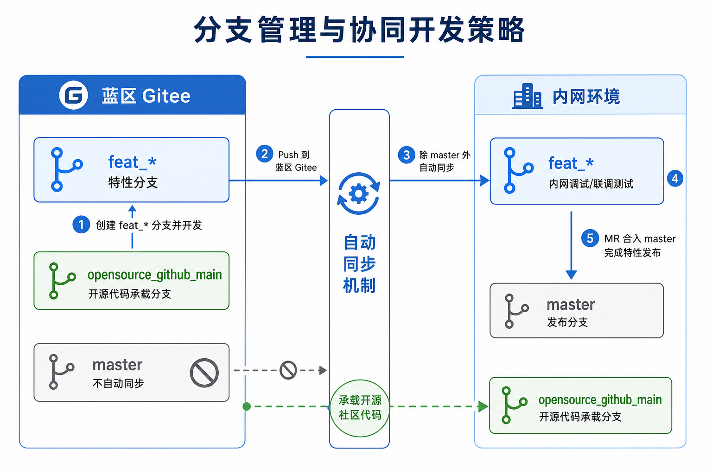
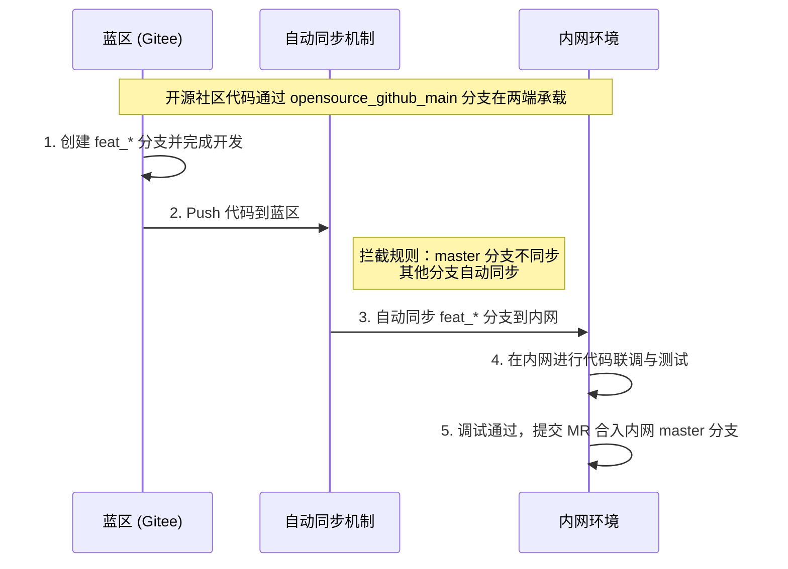

# 分支管理与协同开发指导规范

## 1. 概述
本文档旨在规范代码仓库在蓝区（Gitee）与内网环境下的分支管理策略及协同开发流程，确保特性开发、联调测试与最终发布的顺畅进行，同时保持与开源社区代码的有效同步。

## 2. 分支命名与用途说明

| 分支名称 / 规则 | 所在环境 | 用途说明 |
| :--- | :--- | :--- |
| **`master`** | 内网 | **发布分支**。专门用于特性的最终合入与版本发布。 |
| **`feat_*`** | 蓝区 & 内网 | **特性开发分支**。用于大颗粒特性的开发，命名必须以 `feat_` 开头（例：`feat_user_login`）。 |
| **`opensource_github_main`** | 蓝区 & 内网 | **开源同步分支**。专门用于承载和同步来自开源社区的代码。 |

## 3. 环境同步机制

- **自动同步规则**：在蓝区环境中，**除 `master` 分支以外**的所有分支，在执行 `push` 操作推送到蓝区 Gitee 仓库后，系统会自动将其同步到内网环境。

## 4. 大颗粒特性开发工作流

进行大颗粒特性开发时，请严格遵循以下标准流程：

1. **蓝区建分支**：在蓝区环境中，基于最新基线创建特性开发分支，分支名必须以 `feat_` 开头。
2. **蓝区开发与推送**：在蓝区完成特性的代码开发，并将代码 `push` 到蓝区 Gitee 仓库的对应 `feat_` 分支中。
3. **自动同步**：触发自动同步机制，蓝区的 `feat_` 分支代码会自动同步至内网。
4. **内网调试**：开发人员在内网环境下获取该 `feat_` 分支代码，进行特性的联调与测试。
5. **合入发布**：在内网环境调试通过后，提交 Merge Request (MR) 将该 `feat_` 分支合入内网的 `master` 分支，至此完成该特性的全部开发与发布流程。

---

### 附：流程示意图

