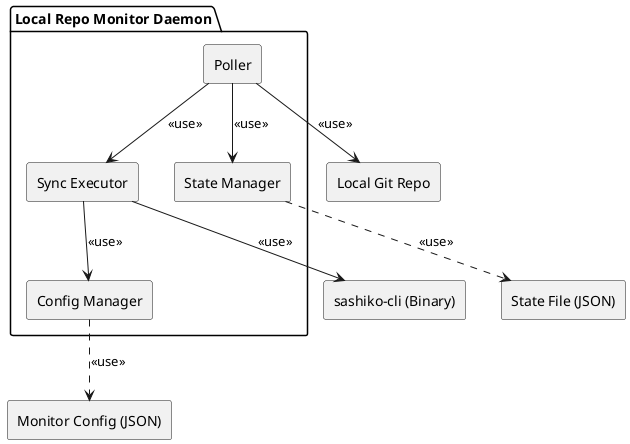
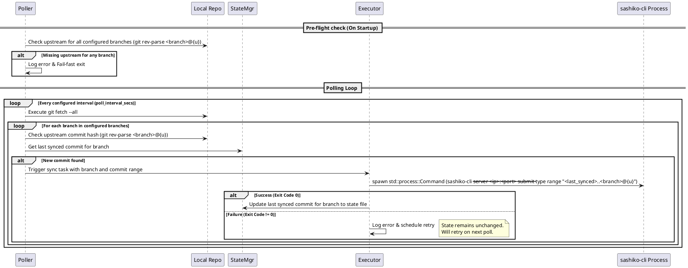

# 特性设计文档：本地仓库 commit 监控工具 (Local Repo Monitor)

**说明**：本需求为新增的常驻后台监控服务，主要通过定期执行 `git fetch` 命令抓取上游更新，并在发现含有代码修改的新 commit 时，通过进程外调用（派生子进程）的方式触发 `sashiko-cli`。

## 1. 背景与目标 (Context & Goals)
为了实现完全自动化的代码流转，我们需要一个能够常驻后台的轮询服务（Daemon）。该工具将监控指定的本地 Git 仓库，支持多分支监控，定期（根据配置的时间间隔，默认 10 秒钟）执行一次 `git fetch --all` 命令。当检测到配置分支的上游跟踪分支 (`<branch>@{u}`) 有新的 commit 产生时，自动调用 `sashiko-cli` 工具，按照 commit 区段将变更批量提交到 sashiko 服务，不再依据文件类型进行过滤。

其核心目标是实现本地代码改动的自动化、可靠同步，同时具备容错和状态恢复能力，并且**完全消除对工作区 Clean 状态的依赖，不执行任何 Checkout 和 Pull 操作**。

## 2. 需求说明 (Requirements)

### 2.1 功能性需求 (Functional Requirements)
- **启动校验 (Pre-flight check)**：服务启动时增加前置检查，遍历配置文件中的所有 `branches`，通过 `git rev-parse <branch>@{u}` 或类似命令检查它们是否配置了 upstream。如果发现任何未配置 upstream 的分支，必须 fail-fast 拒绝启动。
- **定期代码抓取与多分支监控**：每隔配置的时间间隔（默认 1 小时，即 3600 秒）定时在指定的本地 Git 仓库执行 `git fetch --all`（或对应 remote 的 fetch）命令。支持通过配置数组监控多个分支。
- **自动触发同步**：轮询时，如果不依赖工作区，通过对比状态文件中的记录和 `<branch>@{u}` 的最新 commit hash 判断是否有新 commit。如果在抓取后发现新的 commits（分支对应的 `<branch>@{u}` 的 commit hash 与上次记录的不同），则直接通过传入范围的方式，直接调用 `sashiko-cli --type range` 进行批量提交。监控工具**不需要再按照 commit 来过滤 test 和 md 文档**，所有新产生的 commit 都将被原样提交。同时，同步范围受最大时间跨度 (`max_history_days`) 限制，仅提取和提交该天数内的 commit 记录。
- **状态持久化**：每次成功同步后，需将当前分支最新同步的 commit hash 记录到状态文件（如 `.monitor_state.json`，结构为对象数组格式）中，确保重启服务后不会产生重复同步。
- **容错与重试机制**：如果调用 `sashiko-cli` 失败，工具不能跳过该 commit 的同步状态更新。应当在下一次轮询或特定重试队列中重试，直至达到配置的最大重试次数。
- **独立配置**：支持通过外部配置文件指定监控目标、轮询间隔（默认 10s）、监控分支列表、最大时间跨度（默认 180 天）、最大重试次数等信息。

### 2.2 非功能性需求 (Non-Functional Requirements)
- **运行模式**：设计为无 UI 的后台常驻进程（Daemon）。
- **性能**：轮询操作应尽量轻量，不造成明显 CPU 和磁盘 IO 压力，使用 fetch 而不是 pull 可极大降低工作区开销。
- **日志记录**：提供详细且清晰的日志，特别是 `sashiko-cli` 失败的 stderr 输出和重试记录，方便排障。
- **语言**：Rust。

## 3. 架构设计 (Architecture Design)

### 3.1 架构组件图 (Component Diagram)
工具采用高度解耦的模块化设计。



### 3.2 核心业务流时序图 (Sequence Diagram)
以下描述了监控工具每次轮询的执行流。



### 3.3 与 `sashiko-cli` 的交互边界设计
本着“解耦”的原则，初始设计采取 **派生子进程 (Child Process)** 方案：
- **方式**：使用 Rust 的 `std::process::Command` 启动位于 `sashiko` 项目根目录下 `target/release/` 目录中的 `sashiko-cli` 可执行文件。
- **调用命令**：`sashiko-cli --server <server IP>:<server port> submit --type range "<last_synced>..<branch>@{u}"`（其中 server IP 和 port 通过配置文件配置）。
- **优势**：无需依赖 `sashiko-cli` 源码的库级集成，保证现有二进制的独立测试性和完整性，避免过早引入复杂的进程内状态共享或依赖冲突。
- **传递参数**：监控工具在发现新 commit 时，需连同配置好的 server IP 和端口一起，按上述命令格式将 `<last_synced>..<branch>@{u}` 结合 `--type range` 作为参数传递给 `sashiko-cli` 进行批量提交。

## 4. 配置文件结构定义 (Configuration Structure)

### 4.1 配置文件 `monitor_config.json`
移除单一 remote 和 branch，使用 `branches` 数组支持多分支监控。

```json
{
  "pull_interval_sec": 3600,
  "max_retries": 3,
  "max_history_days": 180,
  "server_ip": "127.0.0.1",
  "server_port": 8080,
  "branches": [
    "main",
    "feature-x"
  ]
}
```

**注**：监控的目标仓库路径不再通过此文件配置，而是通过读取 `sashiko` 根目录下的 `Settings.toml` 文件中 `[git]` 节的 `repository_path` 配置项获取。注意，`repository_path` 配置的是一个相对路径，需要将其与 `sashiko` 项目的根目录路径拼接，才能得到监控仓库的完整绝对路径。

### 4.2 状态文件 `.monitor_state.json`
修改为对象数组格式，记录每个被监控分支的最后同步状态及重试次数：

```json
[
  {
    "branch_name": "main",
    "last_synced_commit": "abc123def4567890abcdef1234567890abcdef12",
    "retry_count": 0
  },
  {
    "branch_name": "feature-x",
    "last_synced_commit": "def4567890abcdef1234567890abcdef12abc123",
    "retry_count": 0
  }
]
```

## 5. 核心模块划分 (Core Modules)

在 `my-src/tools/monitor_repo/` 下划分以下模块，并在 `Cargo.toml` 中作为一个独立的 `[[bin]]` 工具进行构建：
- **`config.rs`**：负责 `monitor_config.json` 的解析与反序列化（使用 `serde`），现已支持包含分支数组的配置。
- **`state.rs`**：负责读取和安全地覆写（原子操作或文件锁）状态文件 `.monitor_state.json`。现在需处理由状态对象构成的数组序列化和查找。
- **`poller.rs`**：核心调度循环，利用 `tokio` 或标准库 `thread::sleep` 实现可配置周期（默认 10 秒）的定时任务。并且负责启动时的**前置校验 (Pre-flight check)**，确认所有分支已配好 upstream。
- **`git_checker.rs`**：封装对本地 Git 仓库的轻量级检查命令（执行 `git fetch --all` 和 `git rev-parse <branch>@{u}`）。由于不再使用 `checkout`，相关命令可在不影响工作区的情况下安全执行。
- **`executor.rs`**：负责使用 `Command` 派生子进程执行 `sashiko-cli`，捕获其 stdout/stderr，并根据退出码判断是否成功，执行相应的日志记录和各个分支状态的独立更新。

## 6. 测试策略设计 (Testing Strategy)

### 6.1 可测试性考量 (Testability Considerations)
依赖外部系统（如真实的 Git 仓库、外部可执行文件）会使得测试变得脆弱。必须将外部依赖抽象出 trait 或在测试中使用临时目录（tempdir）和 dummy 脚本。

### 6.2 单元测试规划 (Unit Tests Plan)
- **StateMgr 与 ConfigMgr**：测试 JSON 文件的序列化和反序列化，特别是多分支状态数组格式、读写权限不足或文件格式损坏时的容错处理。
- **Git Checker**：处理分支未设置 upstream 等情况的校验。
- **Poller Logic**：对多分支轮询判断逻辑进行单元测试。给入当前的 state 和 repo head，断言是否正确触发 `Executor`。测试启动前置校验是否能正确拦截异常配置。

### 6.3 端到端测试规划 (E2E Tests Plan)
使用 `tempfile` / `assert_fs` 动态生成一个假的 `sashiko-cli` 脚本或编译一个 mock binary，建立真实的测试 Git 仓库：
1. 建立具有本地提交和 remote origin 提交的测试环境，配置 upstream。
2. 启动 Monitor Daemon 线程，观察 Pre-flight check。
3. 在测试仓库上游模拟新的 commit 变更。
4. 验证 Monitor Daemon 是否正确通过 `git fetch --all` 发现了分支变更，并执行了带有 `--type range` 参数的 mock 的 `sashiko-cli`，且完全没有执行 checkout。
5. 验证 mock 执行失败时，Monitor 不更新对应分支状态文件且产生预期的重试次数日志。
6. 验证 mock 最终成功后，状态文件中的对应分支记录了正确的 commit hash。

## 7. 实施考量与权衡 (Trade-Off Analysis)

- **`git fetch` 替代 `git pull / checkout`**：
  - *优势*：彻底解除了对仓库工作区的依赖。开发者可以在同仓库下进行自己的开发，只要不动对应的上游分支跟踪指针，就不会有冲突和锁竞争，极大地提升了稳定性。
  - *劣势*：本地对应分支的工作区并不会自动更新。但考虑到监控工具的核心诉求仅仅是“提取变更并上传服务器”，无需将变更落回本地工作树，所以这个劣势几乎无影响。
- **子进程 vs 库调用**：
  - *优势*：子进程隔离了内存空间，`sashiko-cli` 崩溃不会导致 Monitor 崩溃。
  - *劣势*：无法通过函数签名传递结构化错误信息，只能依赖进程退出码和 stderr 输出解析。
  - *决定*：在初期先走子进程方案以降低耦合。
- **状态存储方式**：
  - *优势*：使用 JSON 数组存储每个分支的状态，足够轻量，易于运维手动排查和修改。
  - *劣势*：缺乏 SQLite 的事务性和并发写保护，但由于只有 Monitor 会修改该状态文件且为单线程操作，所以风险可控。