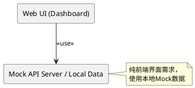
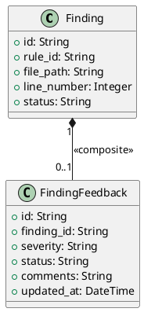
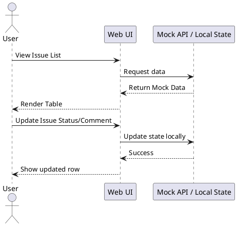
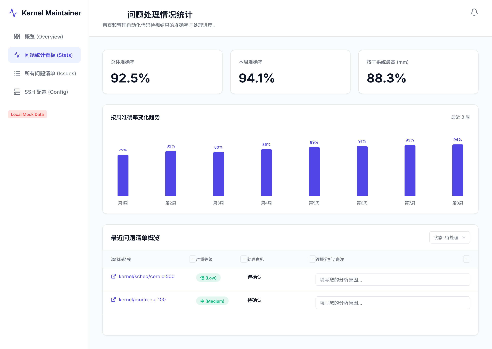
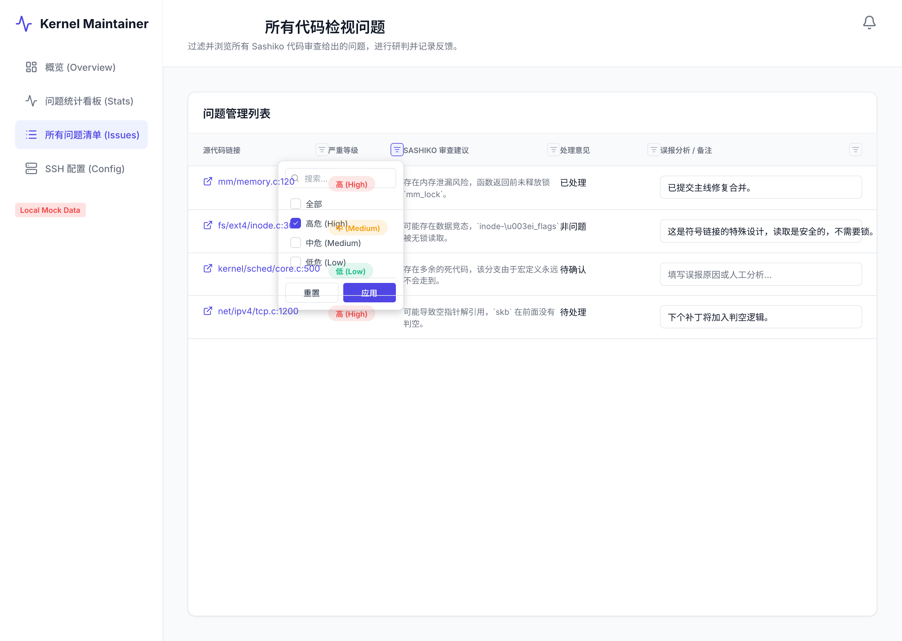

# Spec 00002: Issue Handling Statistics

**本需求包含重构诉求，先完成重构再开发新功能**

## 1. 背景与目标 (Context & Goals)
Kernel-Maintainer 项目需要增加一个自定义统计页面，用于统计问题处理情况。目标是提供直观的准确率趋势看板，以及支持多维度过滤的问题处理清单，方便维护人员跟踪和标记问题状态。

## 2. 需求说明 (Requirements)

### 2.1 功能性需求 (Functional Requirements)
1. **统计指标看板**：
   - 展示总体准确率、按周准确率、按子系统准确率。
   - 准确率计算公式：`有效(TP) / (有效(TP) + 误报(FP))`。
   - 提供按周准确率的折线图趋势展示。
2. **问题分类过滤总表**：
   - 提供清单列表供处理问题。
   - 支持按子系统、严重等级、处理状态等维度进行过滤。
   - 列表项包含：问题原页面链接、严重等级、处理意见（未处理/有效(TP)/误报(FP)）、备注分析（文本输入框）。
   - 支持动态切换处理意见和保存备注分析。

### 2.2 非功能性需求 (Non-Functional Requirements)
- **UI/UX**：遵循经典的 Dashboard 布局，Indigo 主色调，TailwindCSS 样式。
- **性能**：按周和按子系统统计的 API 需要具备良好的查询性能，必要时在数据库层面增加索引。

## 3. 架构设计 (Architecture Design)

### 3.1 组件图 (Component Diagram)

### 3.2 类图 (Class Diagram)

### 3.3 时序图 (Sequence Diagram)

## 4. API 设计 / 接口契约 (API Contracts)

本需求仅涉及前端界面，不提供真实的后端 API。前端代码需内置或通过 Mock.js 模拟以下结构的数据源：

1. **获取统计数据 (Mock)**
   - 模拟返回：包含总体准确率、按周准确率列表、按子系统准确率列表。

2. **获取问题列表 (Mock)**
   - 模拟返回：分页的 `Finding` 及关联的 `FindingFeedback` 列表。

3. **更新问题反馈 (Mock)**
   - 模拟操作：在本地状态中更新 `status`, `comments`, `severity`。

## 5. 数据模型 (Data Models)

*无需实际数据库表结构，但在前端需维护对应的 TypeScript 接口 (Interfaces) 或对象模型。*
- `Finding`
- `FindingFeedback`

## 6. 测试策略与设计 (Testing Strategy & Design)

### 6.1 可测试性考量
- 所有的状态更新均在纯前端层进行管理，组件展示与状态逻辑解耦。

### 6.2 单元测试规划
- `Stats Utils`: 测试前端本地的准确率统计计算函数。
- `Issue Store / Reducer`: 测试前端状态管理对状态更新的响应逻辑。

### 6.3 端到端测试规划
- 模拟用户进入 Dashboard，查看图表数据是否正确渲染。
- 模拟用户在表格中切换某个 Issue 的状态为 TP 并填写备注，验证界面成功更新。

## 7. 部署与交付 (Deployment)

所有的纯前端构建产物及开发代码需同步到后端托管的 UI 目录下 `my-src/src/my-server/webui/`，以供后续集成和运行使用。

## 8. UI 设计草图
*(注：请在 UI 设计完成后，将导出的 `ui-00002-issue-handling.png` 和 `ui-00002-all-issues.png` 放置在 `../ui/` 目录下)*

### 统计看板

### 问题列表

