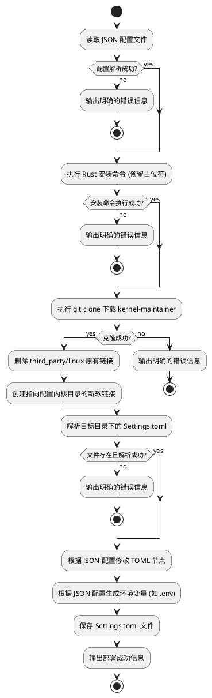

# Spec 00002: 一键部署工具 (One-Click Deployment Tool)

## 1. 背景与目标 (Context & Goals)
当前 `kernel-maintainer` 项目在 Linux 环境下的部署过程依赖手动执行多步操作（安装 Rust、克隆代码、修改配置等），容易出错且效率低下。
本特性的目标是提供一个基于 Python 的一键部署脚本，通过读取预设的 JSON 配置文件，自动化完成环境准备、代码获取和配置注入，从而简化部署流程，提升运维效率。

## 2. 需求说明 (Requirements)

### 2.1 功能性需求 (Functional Requirements)
- **配置读取**：支持读取 JSON 格式的部署配置文件，获取 Git 仓库地址、Linux 内核目录路径及需要注入的 TOML 配置项。
- **Rust 环境安装预留**：脚本需预留执行 Linux shell 命令安装 Rust 的步骤（具体命令留空，以便用户在内网或特定环境中自定义填入）。
- **项目克隆**：根据配置中的 Git 地址，执行 `git clone` 下载 `kernel-maintainer` 项目到指定目录。
- **内核目录软链接配置**：读取 JSON 配置中的 Linux 内核目录路径，在克隆下来的项目 `third_party` 目录下删除原有的 `linux` 目录或软链接，并创建一个指向用户配置路径的新的软链接。
- **配置修改**：使用第三方库（如 `tomlkit`）读取 clone 下来的项目目录中的 `Settings.toml` 文件，并根据 JSON 配置中的键值对进行修改和保存（例如：根据 JSON 中的 `port` 修改 `Settings.toml` 对应的端口配置）。
- **环境变量配置**：读取 JSON 配置中的 `openai_key` 实际值，并在目标环境中配置为环境变量 `LLM_API_KEY`（例如生成 `.env` 文件）。
- **错误处理与中断**：在任何步骤（如配置文件解析失败、网络克隆失败、文件不存在等）发生错误时，必须立即中断部署流程，并向终端输出明确的错误信息。

### 2.2 非功能性需求 (Non-Functional Requirements)
- **目标环境**：Linux 操作系统。
- **独立性**：作为一个独立的运维/部署脚本，不直接耦合或影响现有的 Rust 核心业务代码。
- **易用性**：需提供完整的 `requirements.txt` 依赖声明和 `README.md` 使用文档。

## 3. 架构设计 (Architecture Design)

### 3.1 目录结构规划
本工具作为独立的运维脚本，规划存放在 `my-src/tools/bootstrap/` 目录下：

```text
my-src/tools/bootstrap/
├── deploy.py           # 核心部署脚本
├── config_template.json # JSON 配置文件模板
├── requirements.txt    # Python 依赖声明 (如 tomlkit)
├── README.md           # 使用说明文档
└── tests/              # 测试代码目录
    ├── test_deploy.py  # 单元测试
    └── test_e2e.py     # 端到端测试
```

### 3.2 部署流程活动图 (Activity Diagram)



## 4. API 设计 / 接口契约 (API Contracts)

### 4.1 JSON 配置文件模板设计 (`config_template.json`)
配置文件需结构清晰，分离 Git 配置与应用配置：

```json
{
  "git": {
    "repository_url": "https://github.com/example/kernel-maintainer.git",
    "target_dir": "./kernel-maintainer",
    "branch": "main"
  },
  "linux_kernel_dir": "/path/to/your/local/linux/kernel",
  "rust_install_cmds": [
    "# 在此处填入内网环境的 Rust 安装命令",
    "# 例如: curl --proto '=https' --tlsv1.2 -sSf https://sh.rustup.rs | sh -s -- -y"
  ],
  "app_config": {
    "server": {
      "port": 8080
    },
    "ai": {
      "openai_key": "sk-your-actual-openai-api-key-here"
    }
  }
}
```

### 4.2 配置映射关系 (Configuration Mapping)

部署脚本的 JSON 配置与目标项目 `Settings.toml` 的映射关系如下表所示：

| JSON 配置项 | 对应 `Settings.toml` 配置项 | 作用说明 |
| :--- | :--- | :--- |
| `app_config.server.port` | `[server] port` | 覆盖 `Settings.toml` 中 Web 服务的监听端口。 |

## 5. 测试策略与设计 (Testing Strategy & Design)

### 5.1 可测试性考量 (Testability Considerations)
- 脚本应将核心逻辑（如配置解析、命令执行、TOML 修改）拆分为独立的函数，避免所有逻辑堆砌在全局作用域中。
- 使用 Python 的 `subprocess` 模块执行外部命令时，应允许通过 Mock 拦截调用，以便在不实际执行系统命令的情况下测试逻辑分支。

### 5.2 单元测试规划 (Unit Tests Plan)
- **配置解析测试**：验证能否正确加载合法 JSON，并在 JSON 格式错误或缺失必填字段时抛出预期异常。
- **TOML 修改测试**：提供一个虚拟的 `Settings.toml` 字符串，验证 `tomlkit` 是否能正确修改指定节点并保留原有注释和格式。
- **命令执行测试**：Mock `subprocess.run`，验证在命令返回非 0 状态码时，脚本是否能正确捕获错误并触发中断流程。

### 5.3 端到端测试规划 (E2E Tests Plan)
- 在隔离的 Docker 容器或临时目录中，准备一个包含基本 `Settings.toml` 的本地 Git 仓库作为目标。
- 运行 `deploy.py`，验证其能否成功克隆本地仓库，并正确修改 `Settings.toml` 中的对应字段。

## 6. 实施考量与权衡 (Trade-Off Analysis)
- **优势**：使用 Python 及 `tomlkit` 处理 TOML 文件，相比于 Shell 脚本的正则替换，能够完美保留文件格式与注释，且逻辑更易于维护和扩展。
- **劣势**：引入了 Python 运行时依赖（需要目标机器安装 Python 3 及 `tomlkit` 包）。
- **替代方案**：可考虑使用 Rust 编写该部署工具并编译为静态二进制文件，以消除对 Python 运行时的依赖。但考虑到运维脚本通常需要高频修改和快速调试，Python 仍是当前场景下的最优选择。
