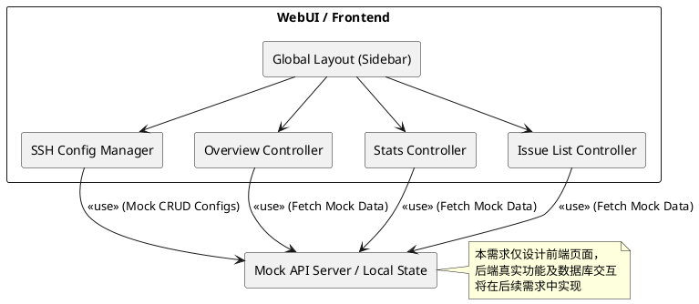
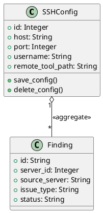
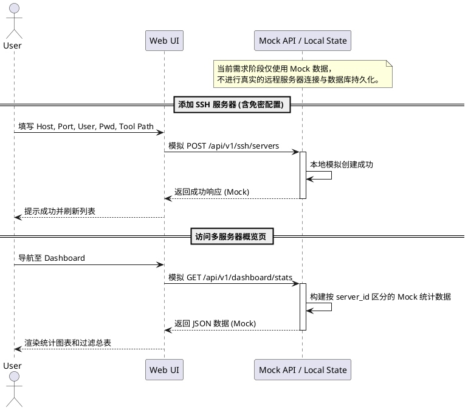
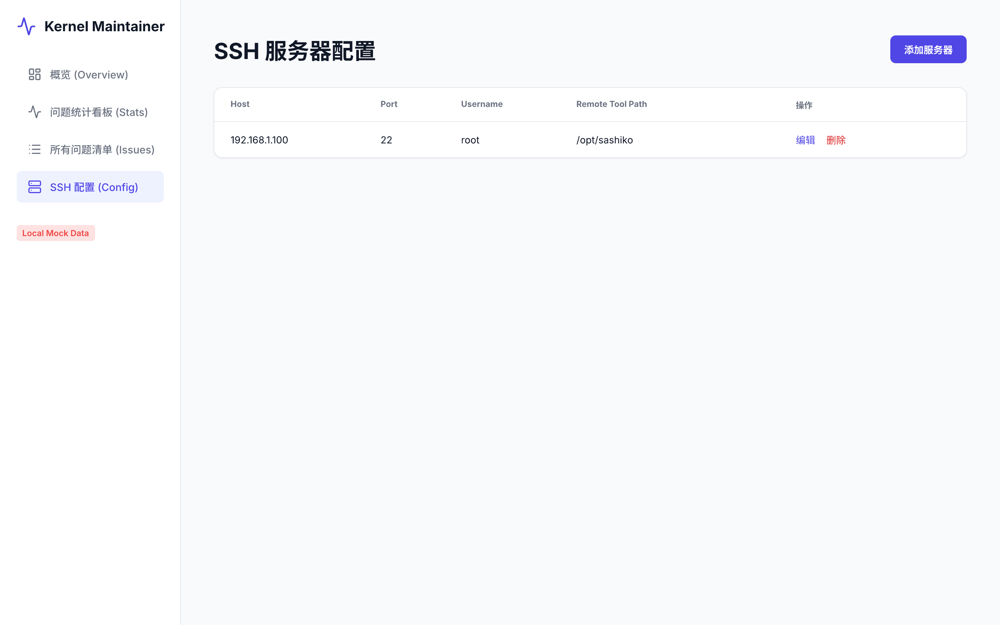
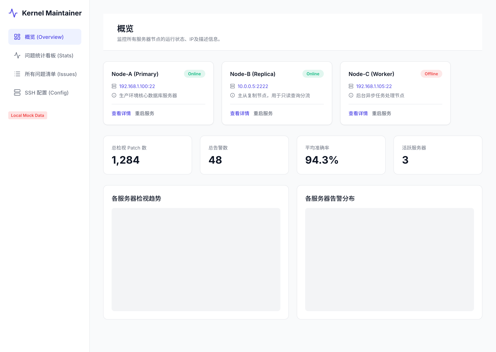

# Spec 00004: 多服务器监控概览与 SSH 配置管理 UI 设计

**本需求包含重构诉求，先完成重构再开发新功能**

## 1. 背景与目标 (Context & Goals)

**背景**：  
随着项目向多节点部署演进，原有的单机版状态和问题统计已不能满足全局监控的需要。系统需要提供统一的多服务器监控概览，并通过 SSH 连接管理远端服务器的配置，为后续的数据拉取与聚合打好基础。同时，为了支持多页面的平滑切换，需要引入全局导航栏。

**目标**：  
1. 提取或完善全局导航栏（Sidebar / Topbar），新增「SSH 配置」或「服务器管理」导航菜单，确保所有页面（概览、问题列表、SSH 配置）共享同一套导航布局。
2. 设计并实现支持多服务器（SSH）配置管理的增删改查前端页面。
3. 将原有的单机概览页面升级为多服务器概览看板（Dashboard），能使用带 `server_id` 区分的 Mock 数据呈现状态、指标及过滤总表。
4. 扩展现有数据模型，增加多服务器维度。

## 2. 需求说明 (Requirements)

### 2.1 功能性需求 (Functional Requirements)
**特别声明：本需求仅设计和实现前端页面交互（包含 UI 及 Mock 数据），不提供真正的后端业务功能与数据库操作。**

1. **全局导航栏集成**：
   - 提供左侧侧边栏 (Sidebar) 导航，包含：“总览 (Dashboard)”、“问题列表 (Issues)”、“SSH 配置 (SSH Config)”。
   - 保持 TailwindCSS + Indigo 主色调的风格统一。
2. **SSH 配置管理 (前端 UI)**：
   - 提供界面用于添加、编辑、删除远程服务器信息（包含：Host, Port, Username, Remote Tool Path）。
   - 提供填写密码配置免密登录的表单交互（仅前端 UI，不执行真实的 SSH 密钥部署）。
3. **多服务器概览 (前端 UI)**：
   - 直观展示各个 Sashiko 服务节点的总体运行状态、IP 及描述信息。
   - 展示多个节点的总体处理指标（总检视 Patch 数、总告警数、平均准确率）。
   - 完全基于前端 Mock 数据实现图表展示逻辑（趋势与分布）。

### 2.2 非功能性需求 (Non-Functional Requirements)
- **UI 风格统一**：采用与现有前端一致的 TailwindCSS 风格，经典 Dashboard 布局，主色调为 Indigo（靛蓝）。
- **安全性**：SSH 密码绝不通过日志打印，不在数据库或本地文件中持久化保存。

## 3. 架构设计 (Architecture Design)

### 3.1 组件图 (Component Diagram)
前后端分离设计，通过 API 层进行通信。前端通过统一的 Layout 模板包裹各个页面。

### 3.2 类图与数据模型 (Class Diagram)
`Finding` 模型需要进行重构，补充 `server_id` 字段以支持概览页面的来源区分。

### 3.3 时序图 (Sequence Diagram)
重点展现包含“免密登录”的安全配置交互与概览页数据的获取。

## 4. 界面设计说明 (UI Design Requirements)

1. **全局导航栏 (Sidebar)**：
   - 包含菜单项：“总览 (Dashboard)”、“问题列表 (Issues)”、“SSH 配置 (SSH Config)”。

2. **SSH 配置管理页 (`ui-00004-ssh-config.pen`)**：
   - 顶部区域：标题及“添加服务器”按钮 (Indigo 主色调)。
   - 内容区域：展示 Host, Port, Username, Remote Tool Path 和操作项（编辑/删除）的表格。
   - 模态框：带有密码输入框的表单，明确提示“密码不会保存在数据库中，仅用于配置免密登录”。
   
   

3. **多服务器概览页 (`ui-00004-multi-server-overview.pen`)**：
   - 顶部区域：各服务器节点的运行状态与基础信息卡片网格 (Server Grid)。
   - 中部区域：全局核心指标统计卡片（汇总多个 Server 的检视数、告警数、准确率）。
   - 底部区域：各服务器检视趋势面积折线图和告警分布饼图。

   

## 5. 测试策略设计 (Testing Strategy)

### 5.1 可测试性考量
- 后端在处理 SSH 配置及验证免密登录逻辑时，需将 SSH 客户端连接逻辑封装，以便在单元测试中进行 Mock，避免测试依赖真实的远程服务器。
- 前端应通过 Mock 服务/拦截器解耦，确保 UI 在没有后端支持时依然能被 E2E 测试和组件测试验证。

### 5.2 单元测试规划 (Unit Tests Plan)
- **数据层**：验证 `SSHConfig` 的持久化写入和读取操作是否正常。
- **业务层**：针对密码处理逻辑编写严格断言，确保无论成功与否，`password` 均不在内部配置结构或序列化 JSON 中残留。
- **接口层**：测试 API 对非法 IP、缺省字段情况的正确拦截及 HTTP 状态码返回（400/422）。

### 5.3 端到端测试规划 (E2E Tests Plan)
- **前端链路 (Playwright/Cypress)**：
  - 测试 Dashboard 顶部服务器卡片的展示是否正确获取到状态信息。
  - 测试 SSH 列表的表单校验及提交交互。
  - 测试全局导航栏的路由跳转是否正常，选中状态是否正确更新。
- **安全验证**：拦截 API 请求 Payload，确认前端发送给后端的密码数据正常，同时验证后端回包时已清洗敏感数据。
