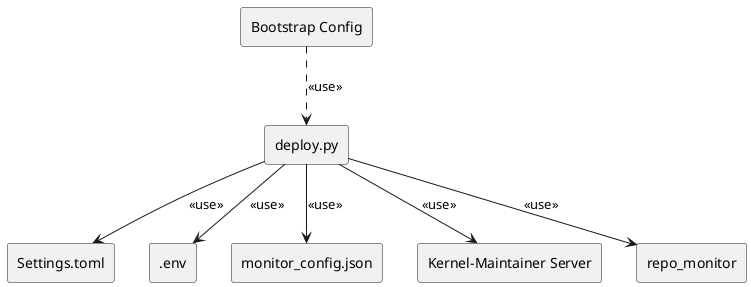
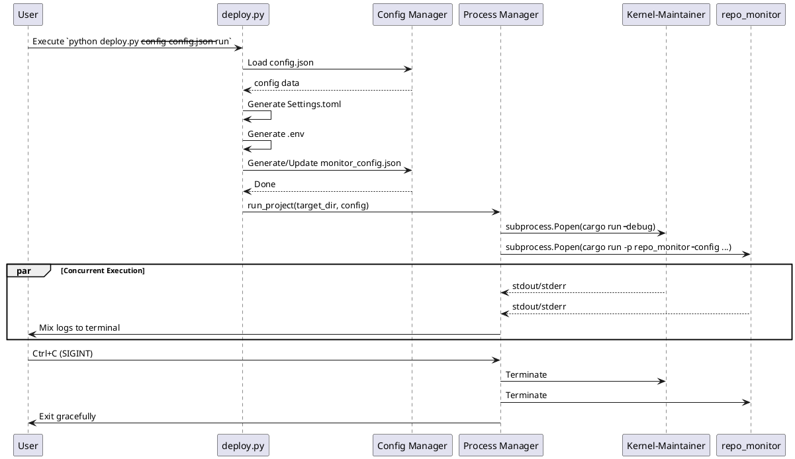

# 特性设计文档：Bootstrap 支持配置与拉起 Repo Monitor

**本需求包含重构诉求，先完成重构再开发新功能**

## 1. 背景与目标 (Context & Goals)

当前项目中的 `repo_monitor` 是一个独立的后台监控服务，但其配置和启动过程尚未与主服务的一键部署脚本 (`deploy.py`) 集成。为了提升用户体验，实现真正的“一键部署与运行”，我们需要在 `bootstrap` 工具中新增功能，使其能够统一配置并同时拉起主服务（Kernel-Maintainer）和 `repo_monitor` 工具。

核心目标：
1. 扩展 `bootstrap` 的配置文件，支持定义 `repo_monitor` 的监控分支。
2. 在部署过程中，自动生成 `repo_monitor` 所需的 `monitor_config.json`。
3. 重构 `deploy.py` 的运行逻辑，使其能够并发启动两个进程，并将日志混合输出到终端，同时妥善处理进程生命周期（如 Ctrl+C 优雅退出）。

## 2. 需求说明 (Requirements)

### 2.1 功能性需求 (Functional Requirements)
- **配置扩展**：在 `my-src/tools/bootstrap/config_template.json` 中新增顶层的 `monitor` 对象，包含 `branches` 数组（监控分支配置）。
- **配置同步**：`deploy.py` 在执行部署流程时，需新增一个配置生成函数，将 `app_config.server` 中的 IP（若无则默认 `127.0.0.1`）和端口，以及 `monitor.branches` 数组，写入到 `my-src/tools/repo_monitor/monitor_config.json` 中。
- **双进程拉起**：当执行 `deploy.py --run` 时，不仅启动位于 `target_dir` 的主服务，还要在 `target_dir` 目录下同时启动 `repo_monitor` 进程（通过 `cargo run --manifest-path <monitor_dir>/Cargo.toml -- --config ...`）。
- **进程管理重构**：重构 `deploy.py` 中的 `run_project` 函数，将原有的阻塞式 `subprocess.run` 替换为 `subprocess.Popen`。主进程需等待两个子进程的输出，并在接收到 `SIGINT` (Ctrl+C) 时，向两个子进程发送终止信号，确保优雅退出。

### 2.2 非功能性需求 (Non-Functional Requirements)
- **日志混合输出**：两个子进程的 `stdout` 和 `stderr` 应当实时混合输出到当前终端，方便开发者调试。
- **容错性**：如果其中一个进程意外崩溃，主进程应当记录错误并根据策略决定是否终止另一个进程或退出。
- **向后兼容**：如果配置文件中没有 `monitor` 节点，应当提供合理的默认值或跳过 `repo_monitor` 的启动。

## 3. 架构设计 (Architecture Design)

### 3.1 架构组件图 (Component Diagram)



### 3.2 核心业务流时序图 (Sequence Diagram)



## 4. 数据模型与配置变更 (Data Models)

### 4.1 `config_template.json` 扩展
在现有配置基础上，增加 `monitor` 节点：
```json
{
  "app_config": {
    "server": {
      "port": 18888
    }
  },
  "monitor": {
    "branches": ["main", "feature-x"]
  }
}
```

### 4.2 生成的 `monitor_config.json`
`deploy.py` 将根据上述配置生成或更新 `my-src/tools/repo_monitor/monitor_config.json`：
```json
{
  "pull_interval_sec": 3600,
  "max_retries": 3,
  "max_history_days": 180,
  "server_ip": "127.0.0.1",
  "server_port": 18888,
  "branches": ["main", "feature-x"]
}
```
*注：`pull_interval_sec`、`max_retries` 等字段若在 `config_template.json` 中未提供，可使用默认值，或保留 `monitor_config.json` 中原有的值。*

## 5. 测试策略与设计 (Testing Strategy & Design)

### 5.1 可测试性考量 (Testability Considerations)
`deploy.py` 是一个 Python 脚本，涉及大量文件系统操作和子进程调用。为了保证可测试性，应当将配置生成逻辑与子进程执行逻辑解耦。

### 5.2 单元测试规划 (Unit Tests Plan)
- **配置生成逻辑测试**：编写 Python 单元测试（如使用 `pytest` 或 `unittest`），传入 Mock 的 `config` 字典，验证 `generate_monitor_config` 函数是否正确生成了预期的 JSON 文件内容。
- **配置合并逻辑测试**：验证当 `monitor_config.json` 已经存在时，脚本是否能正确更新 `server_port` 和 `branches`，同时保留原有的其他配置（如 `pull_interval_sec`）。

### 5.3 端到端测试规划 (E2E Tests Plan)
- **进程管理测试**：编写一个简单的 Mock 脚本替代真实的 `cargo run`，验证重构后的 `run_project` 能否同时拉起两个进程。
- **信号处理测试**：在 E2E 测试中，向 `deploy.py` 发送 `SIGINT`，验证两个 Mock 子进程是否都被正确终止，没有产生僵尸进程。

## 6. 实施考量与权衡 (Trade-Off Analysis)

- **Python `subprocess.Popen` vs `asyncio`**：
  - *权衡*：为了实现双进程日志混合输出，可以使用多线程读取 `stdout/stderr`，或者使用 `asyncio.create_subprocess_exec`。
  - *决定*：考虑到 `deploy.py` 目前是同步脚本，引入 `asyncio` 可能会增加复杂性。使用 `subprocess.Popen` 配合多线程（`threading.Thread`）读取日志，或者直接不捕获管道（让子进程继承父进程的 `stdout/stderr`）是更简单的方案。如果直接继承父进程的输出（即不设置 `stdout=PIPE`），操作系统的终端会自动混合两者的输出，这对于简单的调试场景已经足够，且实现成本最低。
- **优雅退出 (Graceful Shutdown)**：
  - *权衡*：直接 `kill` 可能会导致资源未释放。
  - *决定*：捕获 `KeyboardInterrupt`，调用 `process.terminate()`，并给予一定的超时时间等待子进程退出，若超时则调用 `process.kill()`。