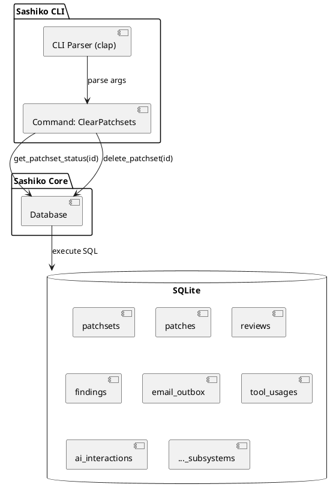
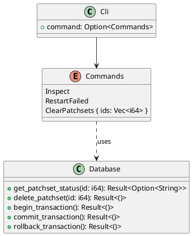
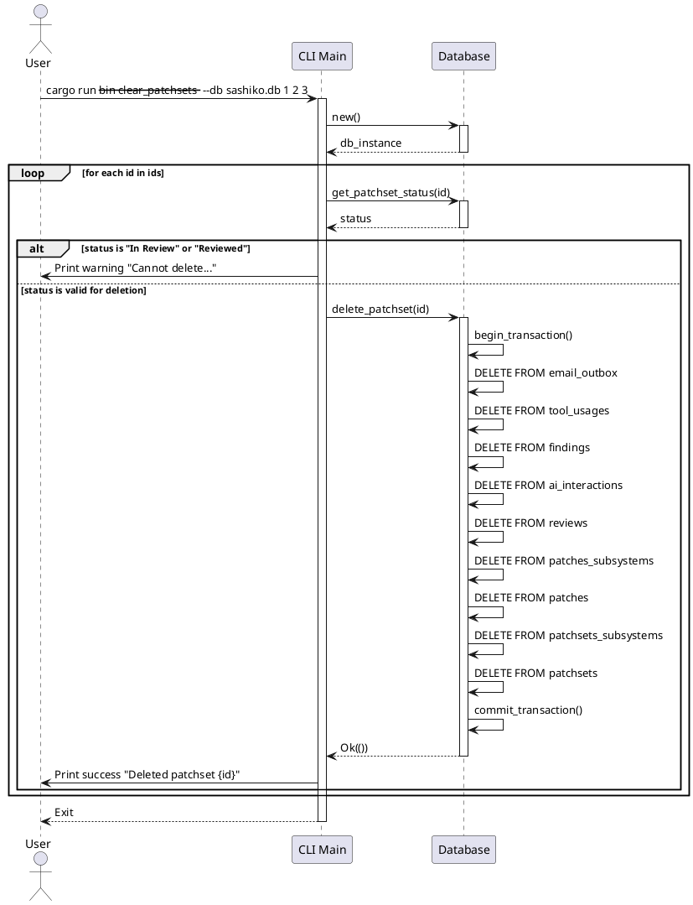

# 特性设计文档：清除未检视 Patchset 工具 (Clear Unreviewed Patchsets)

## 1. 背景与目标 (Context & Goals)
在实际使用 `sashiko` 的过程中，可能会产生一些测试性质、因为配置错误或者其他原因产生的冗余 Patchset 数据。这些数据处于未检视（Unreviewed）状态（如 `Pending`, `Incomplete`, `Failed`, `Cancelled` 等）。为了维护数据库的整洁，需要提供一个 CLI 工具，允许用户手动清理这些无用的 Patchset 及其级联数据。

## 2. 需求说明 (Requirements)

### 功能性需求 (Functional Requirements)
1. **CLI 触发**：在 `my-src/tools/` 下新增 `clear_patchsets` 独立工具，接受一个或多个 Patchset ID，并允许通过参数指定数据库路径（默认值为 `sashiko.db`）。例如：`cargo run --bin clear_patchsets -- --db path/to/sashiko.db 1 2 3`。
2. **状态校验**：在执行删除前，必须检查每个 Patchset 的 `status`。如果状态为 `In Review` 或 `Reviewed`，则**拒绝删除**该 Patchset 并打印警告提示。允许删除的状态包括 `Pending`、`Incomplete`、`Failed`、`Cancelled` 等。
3. **级联物理删除**：由于 SQLite 表结构中部分外键未配置 `ON DELETE CASCADE`，工具必须实现完整的级联删除逻辑，确保数据库整洁。需要清理的关联表包括：
   - `email_outbox` (关联到 patches 的记录)
   - `tool_usages` (关联到 reviews 的记录)
   - `findings` (关联到 reviews 的记录)
   - `ai_interactions` (被 reviews 引用的记录)
   - `reviews`
   - `patches_subsystems`
   - `patches`
   - `patchsets_subsystems`
   - `patchsets`
4. **事务性保证**：删除操作必须在单个事务中完成。如果删除过程中发生错误，必须回滚，保证数据一致性。

### 非功能性需求 (Non-Functional Requirements)
1. **数据保留**：不删除原始的 `messages` 和 `threads` 邮件数据，仅删除检视流程相关的追踪数据。
2. **性能**：由于是 CLI 手动触发，且通常清理的 Patchset 数量不多，多条 `DELETE` 语句的性能开销在可接受范围内。

## 3. 架构设计 (Architecture Design)

### 组件图 (Component Diagram)


### 类图 (Class Diagram)


### 活动图/时序图 (Activity/Sequence Diagram)


## 4. API 设计 / 接口契约 (API Contracts)

### CLI 路由 (`my-src/tools/clear_patchsets/src/main.rs`)
作为独立的 CLI 工具，使用 `clap` 解析参数：
```rust
#[derive(Parser)]
#[command(name = "clear_patchsets", about = "Clear unreviewed patchsets and their associated data")]
struct Cli {
    /// Path to the SQLite database file
    #[arg(short, long, default_value = "sashiko.db")]
    db: String,

    /// The IDs of the patchsets to clear
    ids: Vec<i64>,
}
```

### 数据库操作 (`my-src/tools/clear_patchsets/src/db.rs`)
在 `Database` 结构体中新增以下方法：
```rust
/// 获取指定 Patchset 的状态
pub async fn get_patchset_status(&self, id: i64) -> Result<Option<String>>

/// 事务性地级联删除指定 Patchset 及其所有关联数据
pub async fn delete_patchset(&self, id: i64) -> Result<()>

/// 回滚当前事务（如果需要显式回滚）
pub async fn rollback_transaction(&self) -> Result<()>
```

## 5. 数据模型 (Data Models)

清理操作涉及的表及外键关系（逻辑上的级联删除顺序）：
1. `email_outbox` (依赖 `patches.id`)
2. `tool_usages` (依赖 `reviews.id`)
3. `findings` (依赖 `reviews.id`)
4. `ai_interactions` (被 `reviews.interaction_id` 引用，可以在删除 review 前或后清理，使用 `IN (SELECT interaction_id FROM reviews WHERE patchset_id = ?)`)
5. `reviews` (依赖 `patchsets.id`)
6. `patches_subsystems` (依赖 `patches.id`)
7. `patches` (依赖 `patchsets.id`)
8. `patchsets_subsystems` (依赖 `patchsets.id`)
9. `patchsets` (主表)

## 6. 测试策略与设计 (Testing Strategy & Design)

### 可测试性考量 (Testability Considerations)
- 数据库的 `delete_patchset` 方法可以独立于 CLI 进行单元测试。
- CLI 逻辑可以通过构造不同状态的 Patchset 数据进行集成测试。

### 单元测试规划 (Unit Tests Plan)
- **`test_delete_patchset_cascade`**：在测试数据库中插入一个包含所有关联表数据的 Patchset，调用 `delete_patchset`，断言所有相关表中的数据已被清理，且 `messages` 表中的原始邮件数据未被删除。
- **`test_get_patchset_status`**：验证能够正确读取 Patchset 的状态。

### 端到端测试规划 (E2E Tests Plan)
- **拒绝删除测试**：构造一个状态为 `In Review` 的 Patchset，执行 CLI 命令 `sashiko clear-patchsets <id>`，验证命令输出拒绝提示，且数据库中数据未被删除。
- **成功删除测试**：构造一个状态为 `Failed` 的 Patchset，执行 CLI 命令，验证命令输出成功提示，且数据库中数据被正确清理。

## 7. 实施考量与权衡 (Trade-Off Analysis)

- **优势**：
  - 将复杂的级联删除逻辑封装在 `Database` 的单个事务中，保证了数据的一致性。
  - 状态校验机制有效防止了误删正在处理或已完成的检视任务。
- **劣势**：
  - 如果未来新增了与 Patchset 相关的表，需要同步更新 `delete_patchset` 方法中的删除逻辑。
- **替代方案**：
  - 修改 SQLite 的表结构，增加 `ON DELETE CASCADE` 约束。考虑到这涉及到数据库迁移（Migration）的复杂性以及对现有代码潜在的影响，手动在代码中执行级联删除是当前风险最小、最稳妥的方案。
