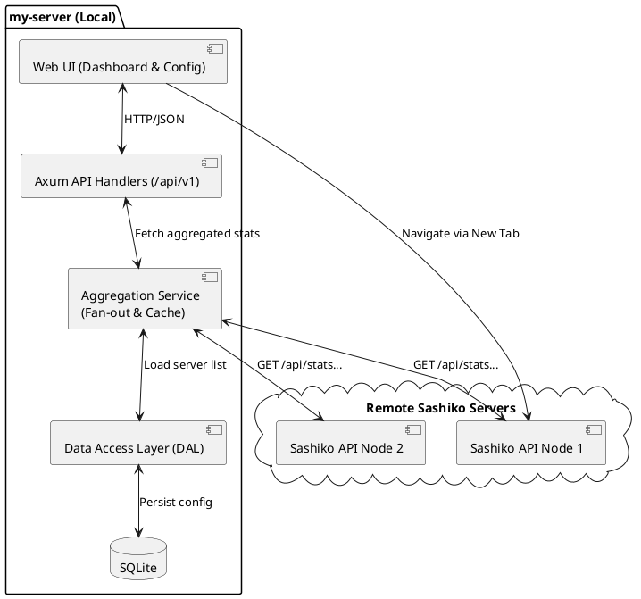
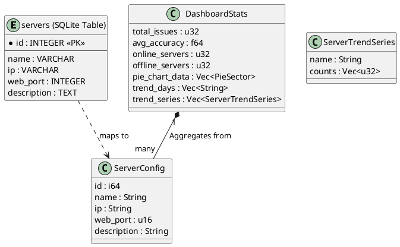
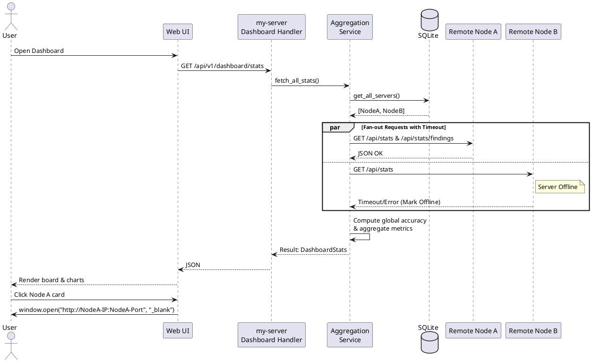
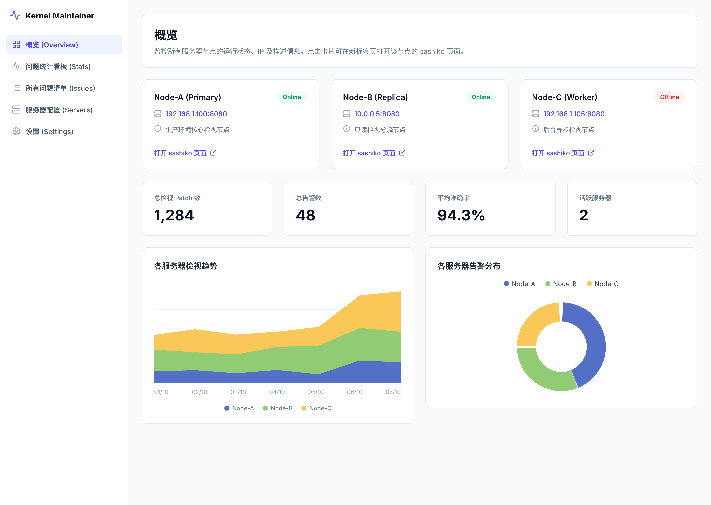

# Spec 00007: 多服务器管理与远端 Sashiko 跳转（多服务器概览看板的实质化）

**本需求包含重构诉求，先完成重构再开发新功能。**

## 1. 背景与目标 (Context & Goals)
本特性是对已有纯前端 Mock 版多服务器 UI 设计（`spec-00004-multi-server-monitor-ui.md`）的**实质化修订与取代**。
目标是将硬编码的 Mock 数据替换为通过本地 `my-server` 代理聚合远端 Sashiko API 得到的真实数据，并在持久化配置时简化掉不再需要的 SSH 凭据（账号/密码/工作目录）。用户将能够通过本地看板掌控多个真实运行的远端 Sashiko 服务器状态，并一键在新标签页直达远端服务。

### 1.1 对 spec-00004 的修订关系
- **取代**：spec-00004 中“SSH 配置管理（含 Host/Port/Username/Password/RemoteToolPath 与免密交互）”整节作废，改为本 Spec 的“服务器配置/管理页”（仅 名称/IP/Web 端口/描述）。
- **取代**：spec-00004 中“完全基于前端 Mock 数据”的概览，改为本 Spec 的“本地后端聚合远端真实 API”。
- **保留**：spec-00004 的全局侧边栏导航布局与 TailwindCSS + Indigo 视觉风格。

## 2. 需求说明 (Requirements)
### 2.1 功能性需求 (Functional Requirements)
1. **服务器配置/管理页**（替代原“SSH 配置页”，导航与页面标题更名为“服务器配置/服务器管理”）：
   - 支持服务器的增删改查 (CRUD)。
   - 表单字段仅包含：**名称 (Name)**、**服务器地址/IP (IP)**、**Web 端口 (Web Port)**、**描述 (Description)**。
   - 配置需持久化存储在本地 SQLite 数据库中。
2. **多服务器概览看板（全部真实数据）**：
   - 展现所有持久化的远端服务器卡片，包含名称、状态（在线/离线）、`IP:Web端口` 和描述。
   - 在线/离线状态由本地后端探测远端可达性得出（远端 `GET /api/stats` 返回 `status==ok` 视为在线）。
   - 核心数字/图表根据远端真实 API 的数据汇算渲染：
     - **趋势图**：远端真实时间线趋势（`/api/stats/timeline`）。
     - **各服务器告警分布饼图**：本地按 Server 聚合各自的 finding 总数拼装，每台一个扇区。
     - **平均准确率**：跨服务器汇总计算 `(to_fix + fixed) / (not_issue + to_fix + fixed)`。
   - 单台服务器不可达时，仅将该服务器卡片标记为“离线”，不可导致整个概览页面渲染崩溃。
3. **跳转交互**：
   - 用户点击整张服务器卡片时，在新标签页打开对应的远端 Sashiko UI (`http://<IP>:<Web端口>`)。
   - 移除此前 Mock UI 中冗余的“重启服务”按钮。

### 2.2 非功能性需求 (Non-Functional Requirements)
1. **低耦合架构**：Web UI 路由处理函数必须与后端的聚合逻辑、数据获取逻辑解耦。
2. **性能与容错**：聚合逻辑在请求远端时需采用并发 Fan-out 模型，设置合理的请求超时阈值与短 TTL 缓存，防止请求风暴与单点阻塞。
3. **前瞻演进能力**：构建抽象的数据访问层 (DAL) 契约，为未来“定期拉取并落库支持离线检索”的架构预留切换空间。
4. **非侵入原则**：绝对不在 sashiko 原生代码中进行破坏性或耦合业务字段的修改；新增逻辑只落在 `my-src/` 下。

## 3. 架构设计 (Architecture Design)

### 3.1 系统组件图 (Component Diagram)
展示本地聚合代理层如何扇出调用远端 JSON API 并服务前端。

### 3.2 数据模型类图 (Class Diagram & Data Models)
描述后端的核心结构以及 SQLite 库表。

### 3.3 核心时序图 (Sequence Diagram)
展示并发调用、容错处理与前端跳转逻辑。

## 4. API 设计契约 (API Contracts)
`my-server` 本地专有命名空间 `/api/v1/...`（注意：远端真实 sashiko 的端点在 `/api/...`，无 `/v1/`，由聚合层 fan-out 调用）：
1. **`GET /api/v1/servers`**: 获取全部服务器配置。
2. **`POST /api/v1/servers`**: 新增配置。
3. **`PUT /api/v1/servers/:id`**: 更新配置。
4. **`DELETE /api/v1/servers/:id`**: 删除配置。
5. **`GET /api/v1/dashboard/stats`**: 返回汇算完毕的大盘统计数据与服务器卡片所需数据。

### 4.1 远端 sashiko 真实端点（聚合层消费）
- `GET /api/stats` → `{status, version, pending, reviewing, messages, patchsets}`：在线探测 + 汇总数字。
- `GET /api/stats/timeline`（支持 `subsystem_id`）→ 真实时间线趋势：趋势图。
- `GET /api/stats/findings` → 按 triage 状态（`pending`/`not_issue`/`to_fix`/`fixed`）分组计数：准确率计算 + 告警分布。

## 5. UI 设计稿 (UI Mockups)

UI 沿用现有 `my-src/src/my-server/webui` 的 TailwindCSS + Indigo 侧边栏布局风格。

### 5.1 多服务器概览页 (`ui-00007-multi-server-dashboard.pen`)
- 左侧侧边栏（**概览**(选中) / 问题处理统计 / 问题列表 / 服务器配置 / 设置）。
- 服务器卡片网格：每张卡片显示 名称、在线/离线 Badge、`IP:Web端口`（可点击）、描述，底部提示「点击卡片打开 sashiko ↗」（整卡点击在新标签页跳转，无「重启服务」按钮）。
- 汇总指标卡：总检视 Patch 数 / 总告警数 / 平均准确率 / 在线服务器。
- 图表：各服务器检视趋势（堆叠柱状）+ 各服务器告警分布（环形图，按 server 聚合 finding 数）。

### 5.2 服务器配置/管理页 (`ui-00007-server-config.pen`)
- 左侧侧边栏（**服务器配置**选中）。
- 服务器列表表格：名称 / 服务器地址(IP) / Web 端口 / 描述 / 状态(在线·离线 Badge) / 操作(编辑·删除)。
- 「添加服务器」模态框：仅 4 个字段（名称 / 服务器地址(IP) / Web 端口 / 描述），并附提示「无需 SSH 用户/密码，仅用于打开远端 sashiko 与拉取统计数据」。

## 6. 测试策略与设计 (Testing Strategy)
- **可测试性 (Testability)**：
  - 数据获取层必须提炼为抽象 Trait（如 `RemoteStatsFetcher`），便于注入 Mock 阻断真实 HTTP 远端调用。
- **单元测试 (Unit Tests)**：
  - 重点测试**聚合计算逻辑**：涵盖多个返回结果时的平均准确率 `(to_fix + fixed) / (not_issue + to_fix + fixed)` 计算，要求分子分母提取无误，规避零除 panic。
  - **容错与超时机制测试**：模拟个别远端节点耗时超时或报错，断言聚合层能及时返回 Partial 数据并将其正确标记为离线。
- **接口/集成测试 (Integration Tests)**：
  - 针对 `/api/v1/servers` 路由进行完整的 CRUD 生命周期测试（模拟 SQLite 操作或内存数据库）。
- **端到端测试 (E2E Tests Plan)**：
  - 前端渲染：验证 dashboard 中收到不同服务器组合数据时，是否正常渲染图表并挂载 `onClick -> window.open` 事件。
  - 无跨域校验：拦截点击事件并断言即将打开的新标签页 URL（`http://IP:Port` 格式）正确性。

## 7. 实施考量与权衡 (Trade-Off Analysis)
- **优势**：不再处理繁重的 SSH 连接，简化了架构模型并大幅降低安全暴露风险。纯浏览器 HTTP 跳转避免了任何的跨域（CORS）问题。
- **劣势/瓶颈**：随着纳管服务器数量增多，即便应用了并发和缓存，实时透传代理仍可能遇到整体耗时抖动。
- **缓解与演进方案**：当前底层架构预留 DAL 层拦截口，当服务器数量激增时，可平滑无缝地从“按需实时 Fan-out”切换至“后台定时拉取、持久化、本地聚合检索”模式，客户端对 API 契约无感。

## 8. 反向边界 (Out of Scope)
- 不做 SSH 连接、远程命令执行、免密部署、服务重启。
- 不在配置中保存任何密码/凭据。
- 不做 HTML 爬取（统一走远端 JSON API）。
- 本次不实现全量问题明细落库与跨服统一问题列表（仅预留 DAL 演进接口）。
