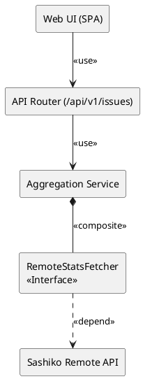
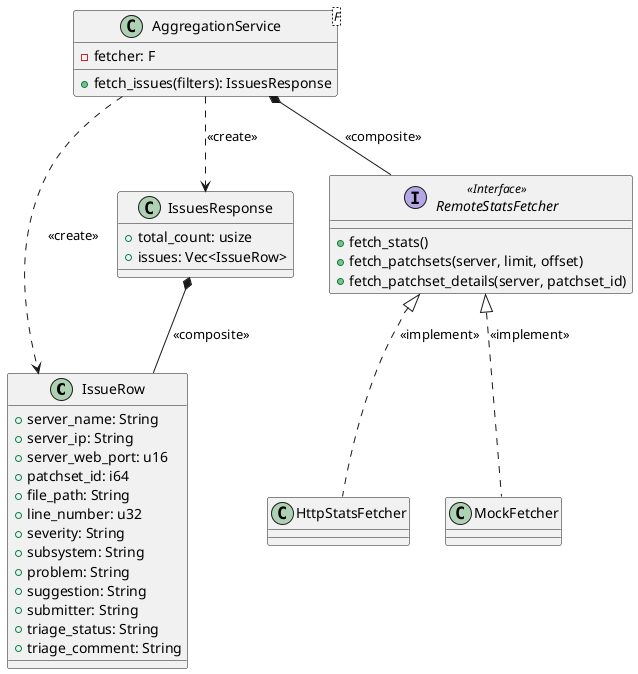
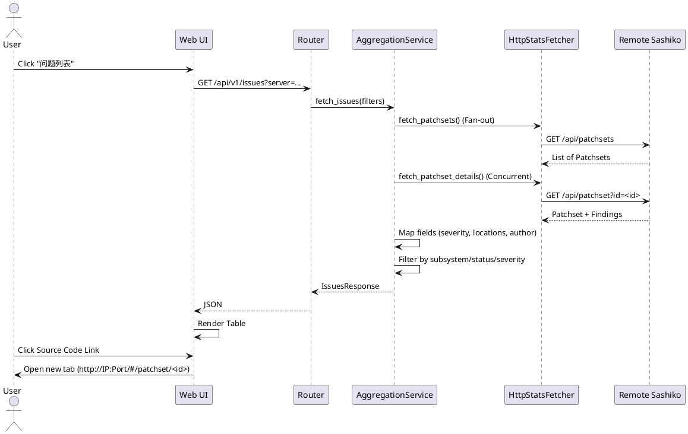
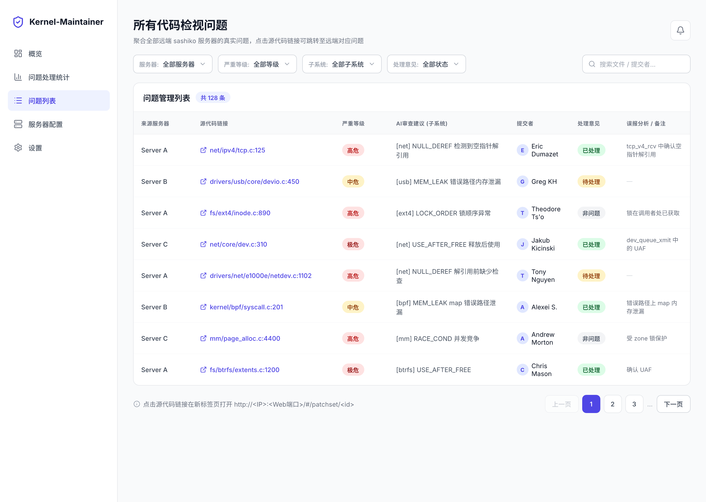

# 特性设计文档：多服务器统一问题列表页 (Multi-Server Unified Issue List)

**本需求包含重构诉求，先完成重构再开发新功能**

## 1. 背景与目标 (Context & Goals)

本项目（Kernel-Maintainer）基于开源 sashiko 演进。在 `spec-00007` 中，我们完成了多服务器的概览与统计数据聚合。本特性 (`spec-00008`) 旨在实质化推迟的「跨服统一问题列表」功能，替换现有的 Mock 数据实现。

**核心目标**：
1. 从所有已配置的远端 sashiko 服务器聚合真实的 findings 数据。
2. 提供统一的、只读的问题列表视图，支持按服务器、严重等级、子系统和处理意见进行过滤。
3. 提供跳转回远端 sashiko 对应 patchset 详情页的源代码链接，实现闭环。

**核心约束**：
- 尽量不修改 sashiko 原生代码，所有定制开发落在 `my-src/` 下。
- 保持后端代码高质量（函数 ≤50 行、文件 ≤500 行、无 unwrap 滥用）。

## 2. 需求说明 (Requirements)

### 2.1 功能性需求 (Functional Requirements)
- **数据源**：本地 `my-server` 聚合所有在线的远端 sashiko 真实 findings。
- **表格展示**：
  1. 来源服务器 (Server Name) - 新增
  2. 源代码链接 (`file:line`，点击在新标签页打开 `http://<IP>:<WebPort>/#/patchset/<id>`)
  3. 严重等级 (Severity: Low/Medium/High/Critical)
  4. AI审查建议 (Problem/Suggestion，需标注子系统)
  5. 提交者 (Patchset 作者姓名，不含邮箱) - 新增
  6. 处理意见 (Triage Status，只读)
  7. 误报分析/备注 (Triage Comment，只读)
- **过滤器**：支持按 服务器、严重等级、子系统、处理意见 进行筛选。

### 2.2 非功能性需求 (Non-Functional Requirements)
- **并发与容错**：聚合层需使用 Fan-out 并发请求远端。单台服务器离线或超时时，仅缺失该服务器数据，绝不导致整页崩溃（Partial Failure 容忍）。
- **低耦合**：Web 路由处理与聚合逻辑解耦，为未来 "定时拉取落库 + 本地检索" 预留 DAL 演进口。
- **性能控制**：由于远端无扁平 findings 接口，需控制并发上限和抓取深度（如限制最近 N 个 patchsets）。

### 2.3 反向边界 (Reverse Boundaries - 本次不做)
- 不在本页做 triage 写回（状态/备注编辑）。
- 不显示提交者邮箱。
- 不修改 sashiko 原生代码。
- 不做 finding 级精确锚点（定位到 patchset 详情页即可）。
- 不做问题明细落库（仅预留 DAL 契约层抽象）。

## 3. 架构设计 (Architecture Design)

### 3.1 组件图 (Component Diagram)



### 3.2 类图 (Class Diagram)



### 3.3 时序图 (Sequence Diagram)



## 4. API 设计 / 接口契约 (API Contracts)

### 4.1 本地 API 契约
**GET `/api/v1/issues`**

**Query Parameters:**
- `server_id` (optional): 过滤特定服务器
- `severity` (optional): 过滤严重等级 (Low/Medium/High/Critical)
- `subsystem` (optional): 过滤子系统
- `triage_status` (optional): 过滤处理状态
- `limit` (optional): 分页大小，默认 50
- `offset` (optional): 分页偏移，默认 0

**Response (JSON):**
```json
{
  "total_count": 120,
  "issues": [
    {
      "server_name": "Node-A",
      "server_ip": "192.168.1.100",
      "server_web_port": 8080,
      "patchset_id": 42,
      "file_path": "mm/memory.c",
      "line_number": 123,
      "severity": "High",
      "subsystem": "mm",
      "problem": "Potential memory leak...",
      "suggestion": "Free the page before returning.",
      "submitter": "John Doe",
      "triage_status": "Pending",
      "triage_comment": ""
    }
  ]
}
```

### 4.2 远端端点消费说明
- `GET /api/patchsets`：获取最近的 patchsets 列表。
- `GET /api/patchset?id=<id>`：获取 patchset 详情，包含该 patchset 下的 findings 列表。

## 5. 数据模型与字段映射 (Data Models & Field Mapping)

- **Severity 映射**：远端 `1` -> `Low`, `2` -> `Medium`, `3` -> `High`, `4` -> `Critical`。
- **Locations 解析**：远端 `locations` 为 JSON TEXT（如 `[{"file": "mm/memory.c", "line": 123}]`），需解析提取第一个元素的 `file` 和 `line`。
- **Submitter 裁剪**：远端 `author` 通常格式为 `John Doe <john@example.com>`，需通过正则或字符串分割提取姓名部分 `John Doe`。
- **Subsystem 继承**：远端 subsystem 挂载在 patchset 级别，在组装 `IssueRow` 时，需将 patchset 的 subsystem 赋值给其下的每一个 finding。

## 6. 测试策略与设计 (Testing Strategy & Design)

### 6.1 后端可测试性
- **Mock 注入**：扩展 `RemoteStatsFetcher` trait，在 `MockFetcher` 中实现 `fetch_patchsets` 和 `fetch_patchset_details`，阻断真实 HTTP 请求。
- **单测**：
  - 测试字段映射逻辑（Severity 转换、Locations JSON 解析、Author 姓名提取）。
  - 测试多服务器结果合并与过滤逻辑。
  - 测试容错机制：模拟某台服务器超时或返回 Error，确保 `AggregationService` 仍能返回 Partial 数据而不 panic。
- **集成测试**：针对 `/api/v1/issues` 路由，验证过滤参数和分页是否生效。

### 6.2 前端与 E2E 测试
- **Playwright E2E**：
  - 验证问题列表正确渲染，包含新增的「来源服务器」和「提交者」列。
  - 验证过滤器（服务器、严重等级等）工作正常。
  - 验证源代码链接的 `href` 正确拼接为 `http://<IP>:<WebPort>/#/patchset/<id>` 且 `target="_blank"`。

## 7. 实施考量与重构权衡 (Trade-Off Analysis)

### 7.1 N+1 Fan-out 性能与容错
**挑战**：远端 sashiko 缺乏扁平的 findings 接口，必须先拉取 patchsets，再逐个拉取 patchset 详情获取 findings。
**方案**：
- **并发限制**：使用 `futures::stream::StreamExt::buffer_unordered` 限制并发请求数（如最大 10 个并发），防止耗尽本地或远端连接池。
- **抓取深度限制**：为保证响应速度，当前阶段仅拉取各服务器最近 N 个（如 20 个）patchsets 的 findings，不进行全量深抓取。
- **超时控制**：对每个 HTTP 请求设置严格的 Timeout（如 3 秒），超时则跳过该 patchset/server，保证整体接口响应在可接受范围内。

### 7.2 演进预留
**挑战**：未来需要支持跨服全量筛选/分析、定时落库与历史检索。
**方案**：在 `AggregationService` 内部，将数据获取逻辑与路由响应逻辑解耦。未来只需将 `fetch_issues` 的底层实现从 "实时 Fan-out" 切换为 "查询本地 DAL (如 `SqliteRepository`)"，API 契约和前端无需任何改动。
**说明**：本地缓存/落库**不在本次范围内**，其决策方向（采用本地 SQLite 落库 + 后台定时拉取，并将"数据新鲜度"列为实现重点）已记录于 `../adr/adr-00002-multi-server-local-cache.md`，供后续 Spec 承接。

### 7.3 死代码清理
在 `spec-00007` 中遗留的 `aggregate()` 函数内空的死代码 `for` 循环，将在本次重构 `AggregationService` 时一并清理。

## 8. UI 设计草图

沿用现有 webui 的 TailwindCSS + Indigo 视觉风格，左侧为全局侧边栏（**问题列表**选中），主区域自上而下为：标题区、过滤器栏（服务器 / 严重等级 / 子系统 / 处理意见 + 搜索框）、问题表格、分页器。表格列依次为：**来源服务器**、源代码链接（外链图标，点击在新标签页跳转远端 `#/patchset/<id>`）、严重等级（Badge）、AI审查建议（子系统）、**提交者**（头像 + 姓名）、处理意见（Badge）、误报分析 / 备注。分页器上方提示「点击源代码链接将在新标签页打开 `http://<IP>:<Web端口>/#/patchset/<id>`」。


