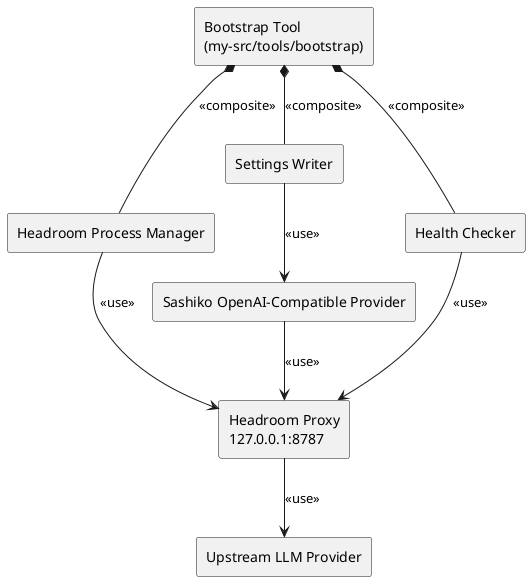
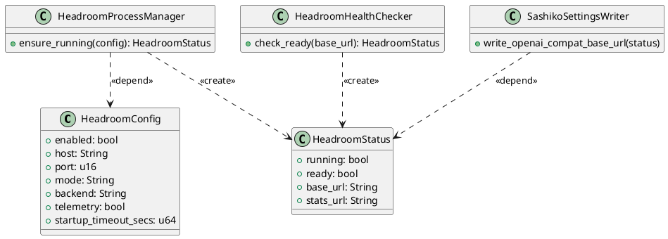
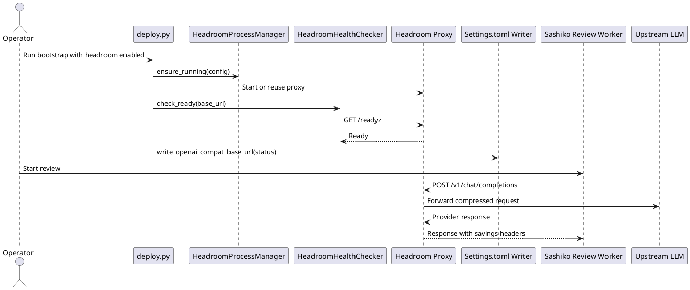

# 特性设计文档：Headroom 上下文压缩代理集成 (Headroom Context Compression Integration)

## 1. 背景与目标 (Context & Goals)

本项目基于开源 Sashiko 演进，当前已支持 OpenAI-compatible provider，并允许通过 `base_url` 指向第三方兼容网关。Headroom 已下载到 `headroom-main/headroom-main/`，其定位是本地上下文压缩代理，默认监听 `127.0.0.1:8787`，对外提供 OpenAI-compatible `/v1/chat/completions`、Anthropic-style `/v1/messages`、`/v1/embeddings`、`/health`、`/readyz`、`/stats`、`/metrics` 等接口。

本特性目标是在不修改 Sashiko 原生代码的前提下，将 Headroom 作为外部压缩代理纳入 Kernel-Maintainer 的部署与运行链路：

1. 通过现有 OpenAI-compatible provider 的 `base_url` 接入 Headroom 代理。
2. 在 `my-src/tools/bootstrap/` 中托管 Headroom 的安装检查、启动配置、健康检查与故障提示。
3. 为后续实现提供 TDD 任务拆解、验收标准和回滚边界。

**核心约束**：
- 尽量不修改 Sashiko 原生代码，所有定制开发落在 `my-src/` 下。
- 不把 `headroom-main/` 直接纳入根 Cargo workspace。
- 不修改 `headroom-main/` 源码；该目录仅作为上游参考。
- 默认采用本地代理模式，保证提示词与上下文在本机压缩处理，Headroom 遥测保持关闭。

## 2. 需求说明 (Requirements)

### 2.1 功能性需求 (Functional Requirements)

- **代理接入**：支持将 Sashiko 的 OpenAI-compatible `base_url` 指向本地 Headroom 代理。
- **启动托管**：扩展一键部署工具，使其能够根据配置启动或复用 Headroom 代理。
- **健康检查**：部署流程在写入 Sashiko 配置前必须检查 Headroom `/health` 或 `/readyz`。
- **配置注入**：部署工具生成或更新 `Settings.toml` 时，应设置 provider、model、`base_url`、streaming、timeout 等必要字段。
- **可观测性**：部署工具应提示 `/stats` 与 `/metrics` 的访问方式，便于人工确认压缩收益。
- **降级策略**：当 Headroom 未安装、端口不可用或健康检查失败时，部署工具应停止并输出可操作建议，不应静默切换到未压缩路径。

### 2.2 非功能性需求 (Non-Functional Requirements)

- **非侵入性**：不修改 `src/ai/openai.rs`、`src/settings.rs` 等 Sashiko 原生文件。
- **可测试性**：Headroom 进程管理逻辑需通过命令执行抽象和 HTTP 健康检查抽象进行测试。
- **可回滚性**：关闭 Headroom 集成只需移除 bootstrap 配置或恢复 `base_url`。
- **安全性**：不得在日志中输出 API Key；不得默认开启 Headroom telemetry。
- **兼容性**：保留现有 OpenAI-compatible provider 的配置语义，避免破坏上游 Sashiko 合并路径。

### 2.3 反向边界 (Reverse Boundaries - 本次不做)

- 不实现 Headroom Rust crate 嵌入。
- 不修改 Headroom 上游源码。
- 不在 Web UI 增加 Headroom 统计面板。
- 不改造 Sashiko provider 工厂或请求翻译逻辑。
- 不做真实 provider API 的自动化 E2E，涉及密钥的验证作为人工验收项。

## 3. 架构设计 (Architecture Design)

### 3.1 组件图 (Component Diagram)

### 3.2 类图 (Class Diagram)

### 3.3 时序图 (Sequence Diagram)

## 4. 配置与接口契约 (Configuration And Interface Contracts)

### 4.1 Bootstrap 配置契约

在 `my-src/tools/bootstrap/config_template.json` 中增加 `headroom` 配置段：

| 字段 | 类型 | 默认值 | 说明 |
|------|------|--------|------|
| `enabled` | bool | `false` | 是否启用 Headroom 集成 |
| `host` | string | `127.0.0.1` | Headroom 绑定地址 |
| `port` | number | `8787` | Headroom 代理端口 |
| `mode` | string | `token` | Headroom 优化模式 |
| `backend` | string | `openrouter` 或现场配置 | Headroom 上游后端 |
| `telemetry` | bool | `false` | 是否开启 Headroom 遥测，默认关闭 |
| `startup_timeout_secs` | number | `20` | 启动与健康检查超时时间 |

### 4.2 Sashiko 配置契约

部署工具在 Headroom 就绪后写入 Sashiko `Settings.toml`：

| 配置区域 | 字段 | 目标值 |
|----------|------|--------|
| `[ai]` | `provider` | `openai-compatible` |
| `[ai]` | `model` | 由部署配置传入 |
| `[ai]` | `api_timeout_secs` | 大于 Headroom 上游超时，建议不低于 300 |
| `[ai.openai_compat]` | `base_url` | `http://<host>:<port>/v1`；Sashiko 会规范化为 `/v1/chat/completions` |
| `[ai.openai_compat]` | `streaming` | 根据 Headroom 与上游能力配置 |
| `[ai.openai_compat]` | `stream_idle_timeout_secs` | 用于代理长连接防挂死 |

### 4.3 Headroom 接口消费

| 接口 | 使用方 | 用途 |
|------|--------|------|
| `GET /health` | Bootstrap | 判断进程是否存活 |
| `GET /readyz` | Bootstrap | 判断代理是否可接流量 |
| `POST /v1/chat/completions` | Sashiko provider | OpenAI-compatible LLM 请求代理入口 |
| `POST /v1/messages` | Headroom / Anthropic 客户端 | Anthropic-style 代理入口，本特性不直接使用 |
| `GET /stats` | Operator | 人工查看压缩收益 |
| `GET /metrics` | Operator / 监控系统 | Prometheus 指标 |

## 5. 数据模型 (Data Models)

### 5.1 `HeadroomConfig`

`HeadroomConfig` 表达部署侧的运行意图，来源于 `config.json`，必须做字段校验。端口必须在合法 TCP 端口范围内；当 `enabled = true` 时，host、port、backend、startup timeout 必须有效。

### 5.2 `HeadroomStatus`

`HeadroomStatus` 表达部署侧观测到的代理状态，包括是否运行、是否就绪、Sashiko 应写入的 base URL，以及用于人工验收的 stats URL。

### 5.3 `Settings.toml` 映射

Headroom 状态只影响 OpenAI-compatible provider 的配置，不新增 Sashiko 原生 schema。后续如需 native schema 支持，必须单独提出 ADR 并获得人类批准。

## 6. 测试策略与设计 (Testing Strategy & Design)

### 6.1 可测试性设计

- 将命令执行封装为可替换接口，单元测试中使用 fake runner 模拟 `headroom proxy` 启动成功、命令缺失、端口占用。
- 将 HTTP 健康检查封装为独立函数，单元测试中使用本地 fake server 或 monkeypatch 的 HTTP client。
- 将 `Settings.toml` 写入逻辑保持为纯函数式转换，输入为现有 TOML 与 `HeadroomStatus`，输出为更新后的 TOML。

### 6.2 单元测试规划

- `test_parse_headroom_config_defaults`：缺省配置时应得到禁用态与安全默认值。
- `test_validate_headroom_config_rejects_invalid_port`：非法端口应返回明确错误。
- `test_ensure_running_reuses_ready_proxy`：已有代理 ready 时不重复启动。
- `test_ensure_running_reports_missing_headroom_command`：命令不存在时输出安装建议。
- `test_write_settings_points_openai_compat_to_headroom`：写入 provider、model、base_url、streaming 与 timeout。
- `test_write_settings_redacts_api_key_in_logs`：日志中不得出现 API Key。

### 6.3 集成测试规划

- 使用 fake Headroom HTTP server 暴露 `/health`、`/readyz`、`/stats`，验证 bootstrap 完整流程。
- 使用临时目录复制 `config_template.json` 与 `Settings.toml`，验证配置写入不污染仓库根目录。
- 模拟 `/readyz` 超时，验证部署工具停止并给出恢复建议。

### 6.4 人工验收

- 本地运行 Headroom 代理后，执行一次 Sashiko review，确认请求经由 Headroom。
- 打开 Headroom `/stats`，确认有压缩请求记录。
- 关闭 Headroom 后重新运行部署流程，确认错误信息可操作且未静默降级。

## 7. 实施考量与权衡 (Trade-Off Analysis)

### 7.1 选择外部代理而非源码嵌入

外部代理接入复用 Sashiko 已有 provider 能力，避免修改原生代码和根 workspace。代价是运行时多一个本地进程，需要 bootstrap 管理健康检查和故障提示。

### 7.2 选择 bootstrap 托管而非纯文档配置

纯文档配置变更最小，但现场部署容易出现 Headroom 未启动、端口错误、base URL 写错等问题。bootstrap 托管能把失败前置到部署阶段，代价是需要新增 Python 测试和进程管理逻辑。

### 7.3 暂不做 Web UI 统计

Headroom 已提供 `/stats` 与 `/metrics`，本阶段先通过链接和人工验收确认收益。将统计接入 `my-server` Web UI 会引入新的前后端 API 和 E2E 范围，适合后续独立 spec 承接。
