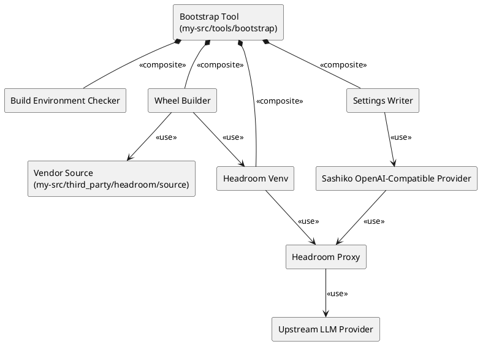
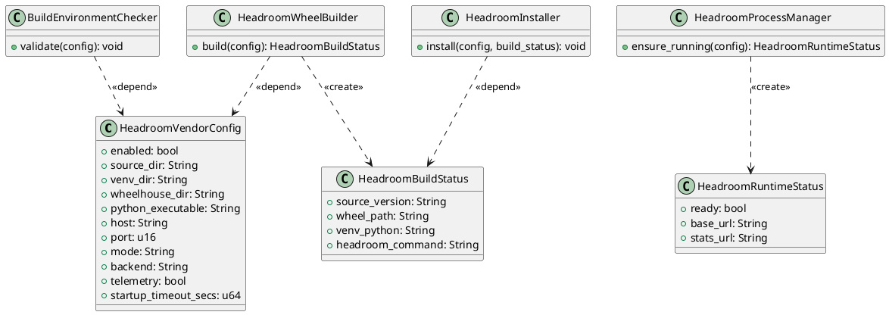
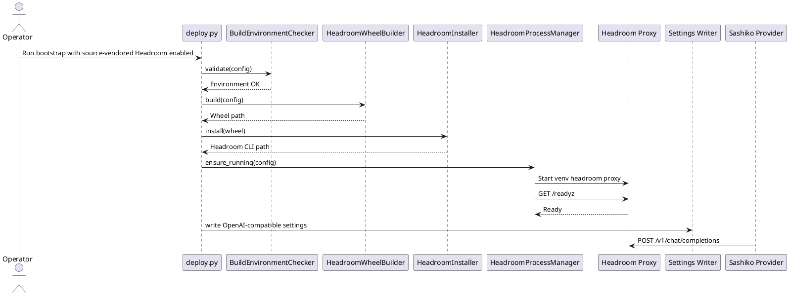

# 特性设计文档：Headroom 源码 Vendor 集成 (Headroom Source Vendor Integration)

**本需求包含重构诉求，先完成重构再开发新功能**

## 1. 背景与目标 (Context & Goals)

`spec-00009` 已定义 Headroom 作为外部上下文压缩代理接入 Sashiko OpenAI-compatible provider 的方案。该方案依赖运行环境中已经安装 `headroom` CLI，适合快速接入，但在内网、离线部署或受控发布环境中仍然存在外部 PyPI 依赖。

本特性 (`spec-00010`) 将 Headroom Python 包以源码 vendor 的方式纳入 Kernel-Maintainer 的自定义目录，并由 bootstrap 在部署时从本地源码构建 wheel、安装到专用虚拟环境、启动本地 Headroom proxy。这样可以把 Headroom 版本固定在项目内，同时继续复用 Sashiko 现有 OpenAI-compatible provider，不修改 Sashiko 原生 `src/` 代码。

**核心目标**：
1. 将 Headroom 上游源码固定到 `my-src/third_party/headroom/source/`。
2. 由 `my-src/tools/bootstrap/deploy.py` 创建专用 Headroom Python 虚拟环境。
3. 从本地 Headroom 源码构建并安装 `headroom-ai[proxy]`。
4. 启动专用 venv 中的 `headroom proxy`，通过 `/readyz` 验证后再写入 Sashiko `Settings.toml`。
5. 在缺少 Python 3.10+、Rust/cargo、maturin、构建失败或健康检查失败时 fail-closed，避免静默走未压缩路径。

**核心约束**：
- 不修改 Sashiko 原生 `src/` 代码，不改造 provider 工厂或 OpenAI-compatible 请求翻译逻辑。
- 不把 Headroom Rust crates 加入根 Cargo workspace。
- `headroom-main/` 下载目录不作为运行时路径；实现时应复制或移动到受控 vendor 目录。
- Vendor 源码默认视为上游快照，除版本更新补丁外不在本项目中直接改 Headroom 源码。
- Headroom telemetry 默认关闭。

## 2. 需求说明 (Requirements)

### 2.1 功能性需求 (Functional Requirements)

- **源码固定**：项目中存在受控的 Headroom 源码目录 `my-src/third_party/headroom/source/`，包含 `pyproject.toml`、`headroom/`、`crates/` 等构建 wheel 所需内容。
- **版本记录**：记录 vendor 来源版本、来源路径或 commit 摘要，便于后续升级审计。
- **构建环境检查**：
  - 检查用于构建 Headroom 的 Python 版本必须 `>=3.10`。
  - 检查 `cargo` 可用，因为 Headroom wheel 通过 maturin 构建 Rust 扩展 `headroom._core`。
  - 检查或安装 `maturin`，但不得从公网隐式拉取不可控依赖。
- **专用 venv**：bootstrap 在可配置路径创建 Headroom 专用虚拟环境，避免污染系统 Python 或 bootstrap 自身依赖。
- **本地 wheel 构建**：bootstrap 从 vendor 源码构建 Headroom wheel，并将构建产物缓存到受控目录。
- **本地安装**：bootstrap 将 `headroom-ai[proxy]` 安装到专用 venv 中。
- **代理启动**：bootstrap 使用专用 venv 中的 `headroom` CLI 启动 `headroom proxy`。
- **配置注入**：Headroom `/readyz` 成功后，bootstrap 写入 Sashiko `[ai].provider = "openai-compatible"` 和 `[ai.openai_compat].base_url = "http://<host>:<port>/v1"`。

### 2.2 非功能性需求 (Non-Functional Requirements)

- **可重复部署**：同一 vendor 版本和配置应生成可复现的部署结果；已存在可用 venv 时可复用。
- **离线友好**：运行时不依赖公网 PyPI；如必须下载依赖，需显式通过配置指向内网 wheelhouse。
- **清晰失败**：环境不满足时输出明确错误，包括 Python 版本、cargo、maturin、wheel 构建、安装、`/readyz`。
- **可回滚**：关闭 `headroom.enabled` 或恢复原 provider 配置即可回滚。
- **安全性**：日志不得输出 API Key；默认 `--no-telemetry`。

### 2.3 反向边界 (Reverse Boundaries - 本次不做)

- 不把 Headroom Rust crate 作为 Sashiko Rust 依赖嵌入。
- 不把 Headroom 统计接入 `my-server` Web UI。
- 不实现 Headroom 源码自动升级器。
- 不在默认测试中真实构建完整 Headroom wheel；真实构建作为人工或 CI 重测试。
- 不保证所有平台 wheel 一次性覆盖；优先支持当前部署目标平台。

## 3. 架构设计 (Architecture Design)

### 3.1 组件图 (Component Diagram)

### 3.2 类图 (Class Diagram)

### 3.3 时序图 (Sequence Diagram)

## 4. 配置与接口契约 (Configuration And Interface Contracts)

### 4.1 Bootstrap 配置契约

在 `config.json` 的 `headroom` 段中增加 source vendor 相关字段：

| 字段 | 类型 | 默认值 | 说明 |
|------|------|--------|------|
| `enabled` | bool | `false` | 是否启用 Headroom |
| `install_mode` | string | `source-vendor` | 安装模式，本 spec 使用 `source-vendor` |
| `source_dir` | string | `my-src/third_party/headroom/source` | Headroom vendor 源码目录 |
| `venv_dir` | string | `my-src/.venv-headroom` | Headroom 专用虚拟环境 |
| `wheelhouse_dir` | string | `my-src/third_party/headroom/wheelhouse` | wheel 构建与离线依赖目录 |
| `python_executable` | string | `python` | 用于创建 venv 和构建 wheel 的 Python |
| `host` | string | `127.0.0.1` | Headroom 监听地址 |
| `port` | number | `8787` | Headroom 监听端口 |
| `mode` | string | `token` | Headroom 优化模式 |
| `backend` | string | `openrouter` 或现场配置 | Headroom 上游后端 |
| `telemetry` | bool | `false` | 默认关闭遥测 |
| `startup_timeout_secs` | number | `20` | 等待 `/readyz` 的超时时间 |

### 4.2 Vendor 目录契约

`source_dir` 必须包含：
- `pyproject.toml`
- `headroom/`
- `crates/headroom-py/`
- `crates/headroom-core/`

`wheelhouse_dir` 可包含：
- 本地构建出的 `headroom_ai-*.whl`
- 离线安装所需依赖 wheel
- 版本元数据文件

### 4.3 Sashiko 配置契约

Headroom ready 后仍沿用 `spec-00009` 的 Sashiko 配置写入：

| 配置区域 | 字段 | 目标值 |
|----------|------|--------|
| `[ai]` | `provider` | `openai-compatible` |
| `[ai]` | `model` | 由 `app_config.ai.model` 指定 |
| `[ai.openai_compat]` | `base_url` | `http://<host>:<port>/v1` |
| `[ai.openai_compat]` | `streaming` | 由现场 provider 能力决定 |

## 5. 数据模型 (Data Models)

### 5.1 `HeadroomVendorConfig`

`HeadroomVendorConfig` 扩展现有 `HeadroomConfig`，表达源码、venv、wheelhouse、Python 解释器和运行时代理配置。启用时必须校验所有路径和字符串字段。

### 5.2 `HeadroomBuildStatus`

`HeadroomBuildStatus` 记录本次构建结果，包括 vendor 源版本、wheel 路径、venv Python 路径和最终使用的 `headroom` CLI 路径。

### 5.3 `HeadroomRuntimeStatus`

`HeadroomRuntimeStatus` 表示代理运行状态，成功时提供 Sashiko 应写入的 `base_url` 和人工验收用的 `stats_url`。

## 6. 测试策略与设计 (Testing Strategy & Design)

### 6.1 单元测试

- `test_vendor_config_defaults_to_source_vendor`：缺省配置应保留安全默认值。
- `test_vendor_config_rejects_missing_source_dir`：缺少 source vendor 目录时失败。
- `test_vendor_config_rejects_python_below_310`：Python 版本低于 3.10 时失败。
- `test_vendor_config_requires_cargo`：缺少 cargo 时失败。
- `test_build_command_uses_vendor_source_and_wheelhouse`：构建命令使用本地源码和 wheelhouse。
- `test_install_command_uses_dedicated_venv`：安装命令只写入 Headroom 专用 venv。
- `test_ready_failure_does_not_write_settings`：代理未 ready 时不写 `Settings.toml`。

### 6.2 集成测试

- 使用 fake runner 验证完整命令序列：环境检查、venv 创建、wheel 构建、安装、启动、ready 检查、settings 写入。
- 使用 fake Headroom HTTP server 验证 `/readyz` 成功和失败路径。
- 使用临时目录验证不会污染仓库根目录 `Settings.toml`。

### 6.3 人工或 CI 重测试

- 在具备 Python 3.10+、Rust/cargo、maturin 的环境中真实构建 Headroom wheel。
- 使用真实 vendor 源码运行 `headroom proxy`。
- 执行一次 Sashiko review 并检查 Headroom `/stats`。

## 7. 实施考量与权衡 (Trade-Off Analysis)

### 7.1 为什么不直接复制 Python 包目录

Headroom 的 `pyproject.toml` 使用 maturin 构建 wheel，并把 Rust 扩展 `headroom._core` 注入 wheel。只复制 `headroom/` Python 源码无法保证 `_core` 可用，也容易遗漏 dashboard、配置、模型和依赖声明。

### 7.2 为什么不嵌入 Rust crate

`headroom-core` 和 `headroom-proxy` 仍处于 Headroom Rust migration 阶段，并引入 ONNX、tokenizer、SQLite、HTTP proxy 等重依赖。将其嵌入 Sashiko 会触碰原生 `src/` 边界并增加上游合并风险。源码 vendor + wheel 构建能固定版本，同时保持代理边界清晰。

### 7.3 Python 版本影响

当前 bootstrap 文档支持 Python 3.8+，但 Headroom 要求 Python 3.10+。本特性不提高整个 bootstrap 的最低 Python 版本；只有启用 `headroom.install_mode = "source-vendor"` 时才要求用于构建 Headroom 的 Python 为 3.10+。

### 7.4 离线依赖风险

源码 vendor 解决 Headroom 项目源码固定问题，但其 Python 依赖仍需 wheel。生产环境应提供内网 wheelhouse，bootstrap 不应在默认路径中隐式访问公网。

## 8. 迁移与回滚

### 8.1 从外部 proxy 模式迁移

1. 将 Headroom 源码放入 `my-src/third_party/headroom/source/`。
2. 设置 `headroom.install_mode = "source-vendor"`。
3. 设置 `source_dir`、`venv_dir`、`wheelhouse_dir`。
4. 运行 bootstrap。
5. 验证 `/readyz` 和 `/stats`。

### 8.2 回滚

1. 将 `headroom.enabled` 改为 `false`，或恢复 `install_mode = "external-cli"`。
2. 恢复原 Sashiko provider 配置。
3. 删除或保留 Headroom venv 均不影响 Sashiko 原生运行。

## 9. 与既有文档关系

- `spec-00009-headroom-context-compression.md`：定义 Headroom 作为代理接入 Sashiko 的基础链路。
- 本 spec：将 Headroom CLI 的来源从外部安装升级为项目内源码 vendor + 本地构建安装。
- `my-src/docs/headroom-usage-guide.md`：实现完成后应更新为 source vendor 优先的操作说明。
