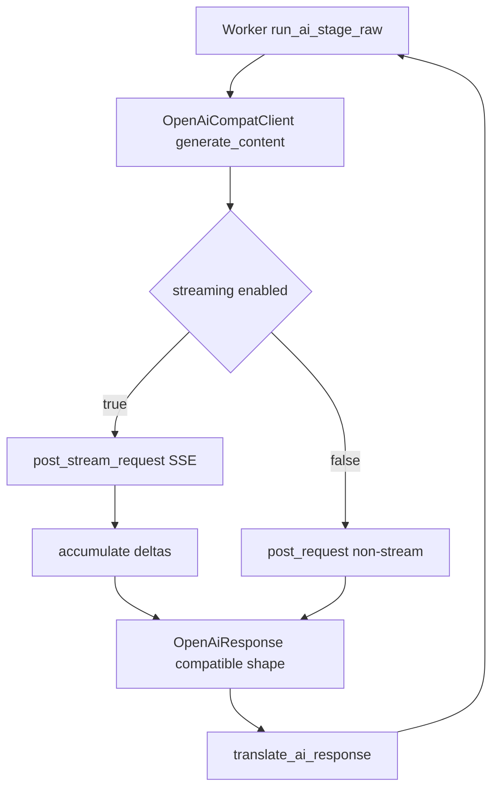

# OpenAI-Compatible 流式响应改造方案

## 背景

当前使用的 LLM 服务经过代理或网关时，如果单个请求在 5 分钟内没有返回任何 response body 数据，代理会判断连接空闲并强制断开。Sashiko 当前的 OpenAI-compatible provider 使用非流式请求，通常会等模型完整生成后才读取并解析整个响应体，因此长生成阶段容易触发该 idle timeout。

本报告给出一份针对当前代码结构的详细修改方案，目标是在不改变多阶段审查协议、不改变数据库结构、不影响现有非流式行为的前提下，为 OpenAI-compatible provider 增加 SSE/streaming 读取能力。

## 目标与边界

目标是解决代理/网关 idle timeout：单次请求生成时间较长时，只要服务端持续返回 SSE chunk，连接就不会因为 5 分钟没有 response body 数据而被代理强制断开。

本方案覆盖当前代码中共用 `OpenAiCompatClient` 的两个 provider：`provider = "openai"` 和 `provider = "openai-compatible"`。第三方网关场景主要使用 `openai-compatible`；官方 OpenAI 场景使用 `openai`。请求结构集中在 `src/ai/openai.rs`，配置结构集中在 `src/settings.rs`，provider 工厂接线位于 `src/ai/mod.rs`。多阶段审查逻辑仍然通过 `generate_content() -> AiResponse` 拿完整结果，当前 Worker 层继续等完整 JSON 或完整文本后再校验和保存，不感知半截 streaming chunk。

不在第一阶段做的事：

- 不改 Web UI/CLI 实时展示。
- 不改 `AiProvider` trait 为全局 stream 接口。
- 不改数据库 schema。
- 不改现有 Stage 调度逻辑。

当前代码校准结论：

- provider 名称必须使用 `openai` 或 `openai-compatible`，不存在 `openai-compat`。
- `[ai.openai_compat]` 是当前共享配置节名，虽然名字是 compat，但同时服务于 `openai` 和 `openai-compatible` 两个 provider。
- 仓库中不存在 `docs/configuration.md`，配置文档应更新到 `README.md` 和 `designs/DESIGN_OPENAI_COMPAT_PROVIDER.md`。
- 已有 ADR `my-src/docs/adr/adr-00001-llm-streaming-api.md` 要求流式解析时拦截 SSE 内部 `{"error": ...}` 对象。

## 当前问题点

当前 OpenAI-compatible provider 使用总请求超时：

```rust
.timeout(Duration::from_secs(api_timeout_secs))
```

并且请求会等待完整 body 后再解析：

```rust
let body_text = res.text().await?;
serde_json::from_str::<OpenAiResponse>(&body_text)
```

这意味着长生成阶段在响应完成前可能长期没有 body 数据，容易触发代理/网关 idle timeout。即使简单增加 `api_timeout_secs`，也只能缓解客户端侧 timeout，不能解决代理认为连接空闲的问题。

## 推荐架构



关键设计是：流式只发生在 `OpenAiCompatClient` 内部。它消费 SSE 事件，累积 `content`、`tool_calls` 和 `usage`，最后组装成现有 `OpenAiResponse`，再复用 `translate_ai_response()` 变成 `AiResponse`。这样 Worker 层无需理解半截 JSON 或半截 tool call。

## 配置设计

在 `src/settings.rs` 的 `OpenAiCompatSettings` 增加 provider 专属开关：

```rust
pub const DEFAULT_OPENAI_STREAM_IDLE_TIMEOUT_SECS: u64 = 240;

#[serde(default)]
pub streaming: bool,

#[serde(default = "default_openai_stream_idle_timeout_secs")]
pub stream_idle_timeout_secs: u64,
```

其中 `default_openai_stream_idle_timeout_secs()` 返回 `DEFAULT_OPENAI_STREAM_IDLE_TIMEOUT_SECS`。因为 `src/ai/mod.rs` 需要在 `[ai.openai_compat]` 整个配置节缺失时也拿到同一个默认值，建议把常量设为 `pub`，避免在多个文件中硬编码 `240`。

建议默认值：

- `streaming = false`，避免改变现有用户行为。
- `stream_idle_timeout_secs = 240`，比 300 秒代理 idle timeout 更早在客户端报出可诊断错误。如果不希望客户端主动断开，也可以设为 `0` 表示禁用 idle guard。

在 `README.md` 和 `designs/DESIGN_OPENAI_COMPAT_PROVIDER.md` 的 `[ai.openai_compat]` 示例中补充：

- `streaming`：启用 OpenAI-compatible SSE 流式响应。
- `stream_idle_timeout_secs`：流式读取时两次 chunk 之间允许的最长空闲时间。

示例：

```toml
[ai]
provider = "openai-compatible"
api_timeout_secs = 300

[ai.openai_compat]
base_url = "https://your-gateway/v1/chat/completions"
streaming = true
stream_idle_timeout_secs = 240
```

## HTTP Client 调整

在 `src/ai/openai.rs` 中给 `OpenAiCompatClient` 增加字段：

- `streaming: bool`
- `stream_idle_timeout_secs: u64`
- `api_timeout_secs: u64`，用于构造非流式 total timeout 和流式 connect timeout。

同步扩展 `OpenAiCompatClient::new(...)` 签名，并在 `src/ai/mod.rs` 的 `create_provider()` 中从 `settings.ai.openai_compat` 读取：

- `streaming = settings.ai.openai_compat.as_ref().map(|c| c.streaming).unwrap_or(false)`
- `stream_idle_timeout_secs = settings.ai.openai_compat.as_ref().map(|c| c.stream_idle_timeout_secs).unwrap_or(crate::settings::DEFAULT_OPENAI_STREAM_IDLE_TIMEOUT_SECS)`

构造 client 时区分两种模式：

- 非流式：保留现有 `.timeout(Duration::from_secs(api_timeout_secs))`。
- 流式：不要设置 total `.timeout(...)`，改用 `.connect_timeout(...)`，例如 `min(api_timeout_secs, 60)` 秒。

这样流式请求不会因为总耗时超过 `api_timeout_secs` 被客户端切断。真正控制卡死的是 `stream_idle_timeout_secs`。

## 请求结构调整

在 `OpenAiRequest` 增加：

```rust
#[serde(skip_serializing_if = "Option::is_none")]
pub stream: Option<bool>,

#[serde(skip_serializing_if = "Option::is_none")]
pub stream_options: Option<Value>,
```

在 `generate_content()` 中：

1. 照旧调用 `translate_ai_request()`。
2. 设置 `openai_req.model = self.model.clone()`。
3. 如果 `self.streaming` 为 true：
   - 设置 `openai_req.stream = Some(true)`。
   - 可设置 `stream_options = Some(json!({"include_usage": true}))`，兼容支持该选项的 OpenAI-compatible 服务。
   - 调用 `post_stream_request()`。
4. 否则走现有 `post_request()`。

为支持 usage fallback，`generate_content()` 应在消费 `AiRequest` 前先计算 `prompt_tokens = estimate_tokens_generic(&request)`，再把 request 传入 `translate_ai_request()`。流式路径如果最终没有收到 usage，就用这个 prompt token 估算值和聚合后的 completion 文本生成 `OpenAiUsage`。

注意：部分 OpenAI-compatible 服务不支持 `stream_options.include_usage`，因此如果服务返回 400 且错误文本明确包含 `stream_options`、`include_usage`、`unsupported`、`unknown field` 等关键字，可以选择 fallback 到不带 `stream_options` 的 streaming 请求。这个 fallback 只做一次；其他 400 仍按真实参数错误返回，避免掩盖 schema 或模型参数问题。

## SSE 解析与聚合

新增内部结构用于解析 OpenAI streaming chunk：

```rust
struct OpenAiStreamChunk {
    choices: Vec<OpenAiStreamChoice>,
    usage: Option<OpenAiUsage>,
}

struct OpenAiStreamChoice {
    index: u32,
    delta: OpenAiDelta,
    finish_reason: Option<String>,
}

struct OpenAiDelta {
    role: Option<String>,
    content: Option<String>,
    tool_calls: Option<Vec<OpenAiToolCallDelta>>,
}

struct OpenAiToolCallDelta {
    index: u32,
    id: Option<String>,
    #[serde(rename = "type")]
    tool_type: Option<String>,
    function: Option<OpenAiToolCallFunctionDelta>,
}

struct OpenAiToolCallFunctionDelta {
    name: Option<String>,
    arguments: Option<String>,
}

struct OpenAiStreamError {
    error: OpenAiStreamErrorBody,
}

struct OpenAiStreamErrorBody {
    message: Option<String>,
    #[serde(rename = "type")]
    error_type: Option<String>,
    code: Option<Value>,
}
```

实现 `post_stream_request(&self, body: &Value, prompt_tokens: u32) -> Result<OpenAiResponse, OpenAiCompatError>`：

1. 发送 `client.post(...).json(body).send().await`。
2. 如果 status 非 2xx，复用现有错误处理逻辑，解析 `retry-after`、429、5xx 等。
3. 成功后读取 `res.bytes_stream()`。
4. 按 SSE 规范处理：
   - 缓冲字节到字符串。
   - 按空行切分 event。
   - 只处理 `data:` 行。
   - 遇到 `data: [DONE]` 结束。
   - 支持一个 event 内多行 `data:`，按换行合并。
   - 忽略 SSE 注释行，例如以 `:` 开头的 heartbeat。
5. 每解析一个 chunk：
   - 先尝试解析 `{"error": ...}`，如果存在则立即中断；rate limit 或 overload/server error 映射为 `RateLimitExceeded` / `TransientError`，其他流内错误映射为 `ApiError(StatusCode::OK, error_text)`，与 ADR-00001 保持一致。
   - 累积 `delta.content` 到最终 `message.content`。
   - 累积 `delta.tool_calls` 的 `id`、`function.name`、`function.arguments`。
   - 记录 `finish_reason`。
   - 如果 chunk 带 `usage`，保存 usage。
6. 结束后组装 `OpenAiResponse { choices, usage }`。

`OpenAiResponse` 当前要求 `usage: OpenAiUsage` 和 `OpenAiChoice.finish_reason: String` 都是必填字段，因此流式聚合结束时必须补齐：

- 如果没有 usage，则使用传入的 `prompt_tokens`，并用 `TokenBudget::estimate_tokens(content)` 加上所有 tool call argument 字符串估算 completion tokens。
- 如果没有 finish reason，存在 tool calls 时默认 `"tool_calls"`，否则默认 `"stop"`。
- 如果没有任何 content 和 tool calls，应返回解析错误，避免把空响应误判为成功。

idle guard 采用每次读取 chunk 的粒度实现：用 `tokio::time::timeout(Duration::from_secs(self.stream_idle_timeout_secs), stream.next()).await` 包装每一次 `next()`。当 `stream_idle_timeout_secs = 0` 时禁用 idle guard。超时应映射为 `OpenAiCompatError::TransientError(Duration::from_secs(30), "...stream idle timeout...")`，让现有上游重试机制可以继续工作。

## Tool Call Streaming 处理

OpenAI tool call streaming 通常会把参数分片返回，例如：

```json
{"index":0,"id":"call_x","type":"function","function":{"name":"git_log","arguments":"{\""}}
{"index":0,"function":{"arguments":"limit\":10}"}}
```

聚合规则：

- 以 `tool_calls[].index` 为 key。
- `id` 第一次出现后保存。
- `function.name` 第一次出现后保存。
- `function.arguments` 每次追加字符串片段。
- `[DONE]` 后把完整 `arguments` 字符串交给现有 `translate_ai_response()` 解析为 `serde_json::Value`。

这样 `run_ai_stage_raw()` 仍然只看到完整的 `ToolCall`，后续执行工具和追加 `AiRole::Tool` 的逻辑不变。

## 依赖调整

`Cargo.toml` 当前 `reqwest` 只启用了 `json` feature：

```toml
reqwest = { version = "0.13.1", features = ["json"] }
```

需要增加 `stream` feature：

```toml
reqwest = { version = "0.13.1", features = ["json", "stream"] }
```

项目已依赖 `futures`，可以直接使用 `futures::StreamExt` 读取 `bytes_stream()`。

## 测试方案

新增或扩展 `src/ai/openai.rs` 里的单元测试：

- 序列化 streaming 请求：`stream = true`，并可带 `stream_options.include_usage`。
- 解析普通 content delta：多段 `data:` 累积为完整文本。
- 解析 `[DONE]`：正确结束，不把 `[DONE]` 当 JSON。
- 解析 usage chunk：`usage` 能写入 `AiUsage`。
- 解析 tool call delta：分片参数能合并成完整 JSON 参数。
- 解析流内 `{"error": ...}`：HTTP 200 但 SSE data 中有 error 时返回错误，不返回半截成功响应。
- 处理非 2xx：429、5xx 仍按现有错误分类返回。
- 处理 idle guard：模拟 stream 长时间没有 chunk 时返回 transient error。
- 兼容非流式：`streaming = false` 时仍走现有 `post_request()`。
- usage fallback：没有 streaming usage 时，用 prompt token 估算值和 completion 文本估算 usage。
- finish reason fallback：缺失 `finish_reason` 时仍能构造现有 `OpenAiResponse`。

新增或扩展 `src/ai/mod.rs` / `src/settings.rs` 里的配置接线测试：

- `[ai.openai_compat].streaming = true` 和 `stream_idle_timeout_secs = N` 能正确反序列化。
- `[ai.openai_compat]` 缺失时，`create_provider()` 使用 `streaming = false` 和 `DEFAULT_OPENAI_STREAM_IDLE_TIMEOUT_SECS`。如果保持 `Arc<dyn AiProvider>` 不支持 downcast，不要为了测试修改 trait；可把 openai 配置提取逻辑拆成一个小的内部 helper，并直接测试该 helper。
- `provider = "openai"` 和 `provider = "openai-compatible"` 都继续能创建 provider。

如果不想在第一轮引入 HTTP mock server，可以先把 SSE 解析器拆成纯函数，例如 `parse_openai_sse_events(raw: &str, prompt_tokens: u32) -> Result<OpenAiResponse>`，先覆盖解析逻辑；随后再加一个 tokio 测试覆盖真实 `bytes_stream()` 和 idle guard。

## 验证命令

计划实施后，建议按这个顺序验证：

```bash
cargo test -p sashiko ai::openai --lib
cargo test -p sashiko ai::tests::test_create_provider --lib
cargo test -p sashiko --lib
cargo check
```

如果本地有可用 OpenAI-compatible 服务，再用小 prompt 做一次手动集成验证：

```toml
[ai]
provider = "openai-compatible"
api_timeout_secs = 300

[ai.openai_compat]
streaming = true
stream_idle_timeout_secs = 240
```

然后跑一个最小本地审查或单 provider 调用，确认日志中能看到 streaming 请求完成，且不再因 5 分钟无 body 数据被代理断开。

## 风险与降级策略

主要风险：

- 某些 OpenAI-compatible 服务的 streaming chunk 格式不完全标准。
- 某些服务不返回 streaming usage。
- 某些服务不支持 `stream_options.include_usage`。
- 如果模型 prefill 超过 5 分钟且服务端不发送 heartbeat，streaming 仍然无法避免代理 idle timeout。

降级策略：

- `streaming` 默认关闭。
- streaming 请求失败且错误明确是“不支持 stream_options”时，重试一次不带 `stream_options`。
- 如果服务完全不支持 streaming，用户可以关闭 `streaming` 回到现有非流式路径。
- 保留现有非流式 `post_request()` 和所有现有错误分类逻辑。

## 实施任务清单

1. 在 `src/settings.rs` 增加 `[ai.openai_compat]` 的 `streaming` 和 `stream_idle_timeout_secs` 配置项及默认值。
2. 在 `src/ai/mod.rs` 扩展 `create_provider()`，把 streaming 配置传入 `OpenAiCompatClient::new()`。
3. 在 `src/ai/openai.rs` 扩展 `OpenAiRequest`、`OpenAiCompatClient` 字段和构造函数签名。
4. 为 streaming 模式调整 reqwest client，移除 total timeout 并设置 connect timeout；非 streaming 保持现有 total timeout。
5. 实现 OpenAI-compatible SSE 读取、解析和内容/tool_call/usage 聚合，包含流内 `{"error": ...}` 拦截、usage fallback、finish reason fallback 和 idle guard。
6. 在 `generate_content()` 中按配置选择非流式或流式请求路径，并实现 `stream_options.include_usage` 的一次性 fallback。
7. 补充 content、tool call、usage、流内错误、HTTP 错误、idle guard、非流式兼容和 provider 工厂配置传递的单元测试。
8. 更新 `README.md` 和 `designs/DESIGN_OPENAI_COMPAT_PROVIDER.md` 的配置说明，不新增不存在的 `docs/configuration.md`。
9. 运行 openai provider 测试、provider 工厂测试、库测试和 `cargo check` 验证。

## 后续增强

第一阶段解决 idle timeout 后，可以再做两个增强：

- 把 `streaming` 抽象提升到 `AiProvider` trait，支持 Claude/Gemini/Bedrock/Vertex 的原生 streaming API。
- 把 `ContentDelta`、`ToolCallStarted`、`StageStarted` 等事件推到 daemon/Web UI/CLI，提供真正的实时审查进度展示。
